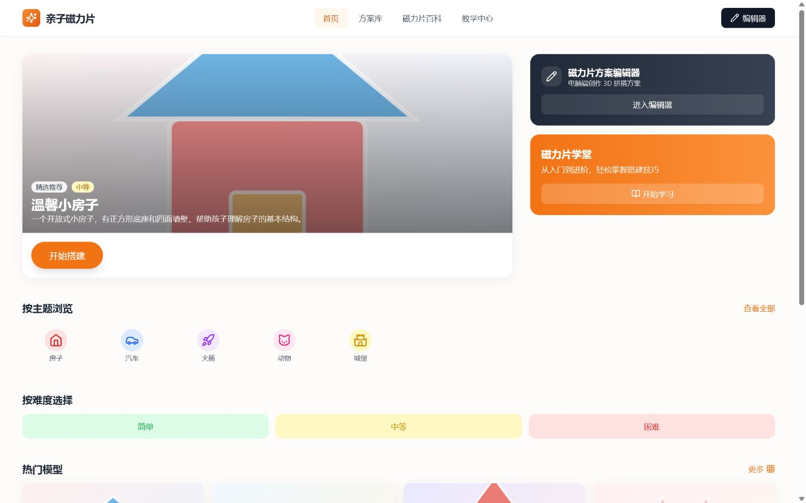
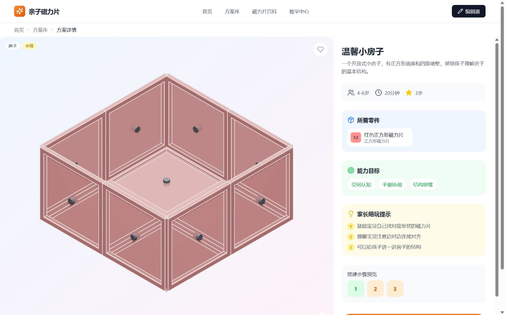
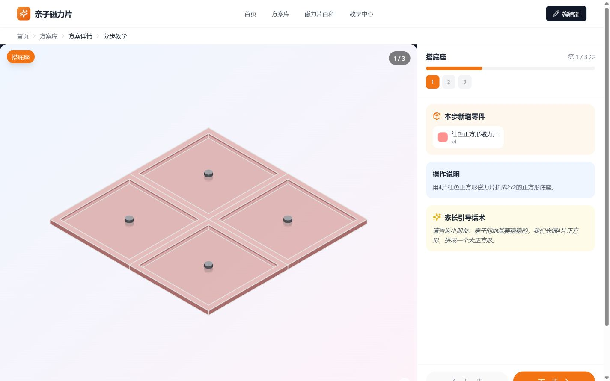
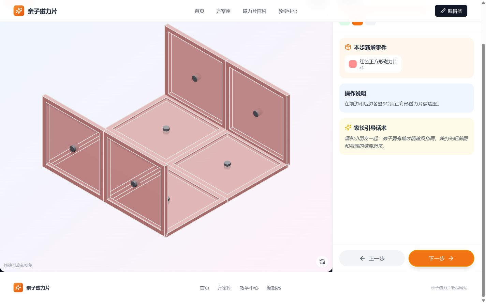
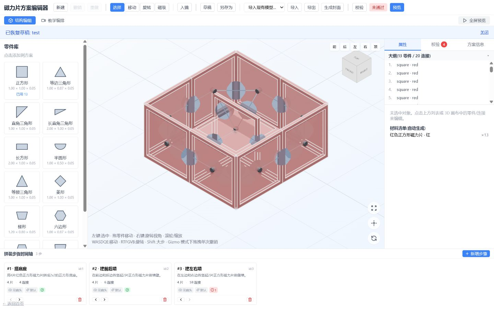
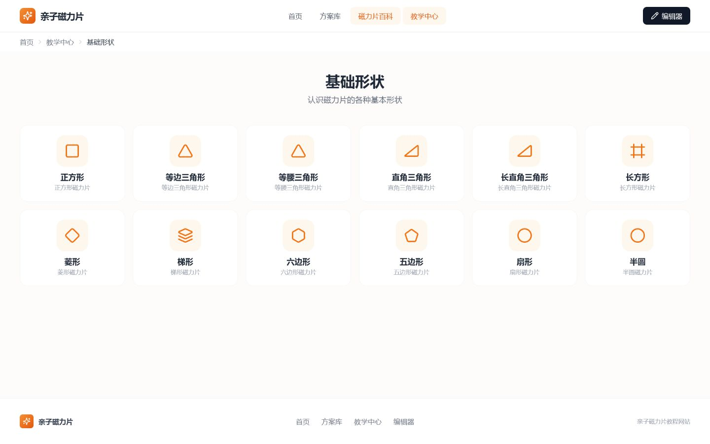
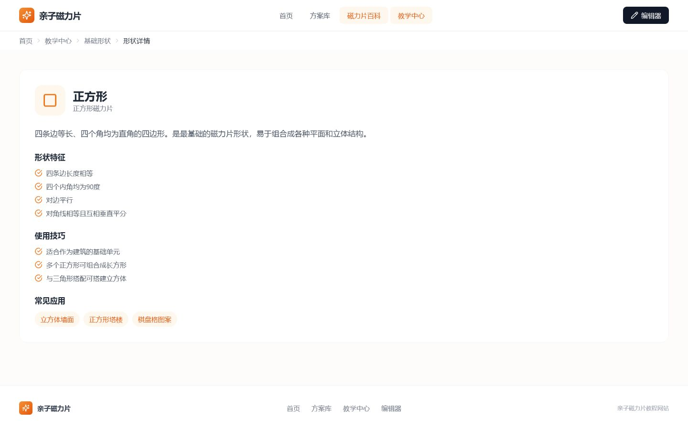
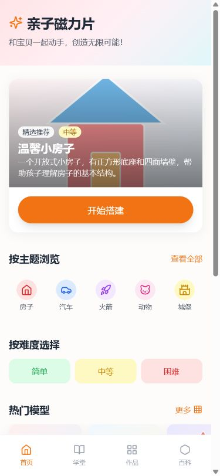
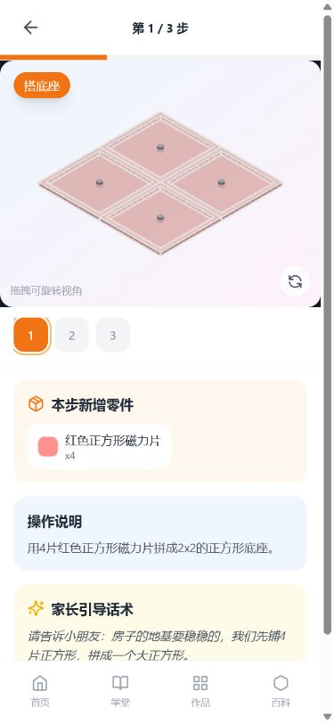

# 3D 磁力片 App 竞品深度分析

> 调研日期：2026-07-29
> 调研对象：MagneticBlox、LEGO Builder、Brickit、BILT、CONNETIX Ideas / PlayZone、Blox 3D Junior、LEGO Play、Zuvvo 3D Build Hub
> 对照产品：当前工作区中的「亲子磁力片」React / Three.js Web App
> 目标：让没有实际体验条件的读者，也能理解每个产品"解决什么问题、首页长什么样、如何完成核心任务、为什么这样设计、背后团队能做成什么，以及哪些做法值得借鉴"。

---

## 0. 结论先行

### 0.1 这 8 个对象不是同一种竞品

它们分别代表四种完全不同的产品范式：

| 范式 | 产品 | 用户购买的核心价值 |
|---|---|---|
| 实体玩具的 3D 说明书 | MagneticBlox、LEGO Builder、BILT、Zuvvo | "告诉我下一片/下一个零件放哪里" |
| 实体零件识别与再利用 | Brickit | "根据我手里已有的零件，告诉我能搭什么，并帮我找零件" |
| 数字 3D 创作工具 | Blox 3D Junior、LEGO Play 的 Brick Builder | "不依赖实体零件，直接在屏幕里创作" |
| 灵感内容与教育/商业生态 | CONNETIX PlayZone、LEGO Play 社区 | "持续给我玩法、挑战、内容和社交反馈" |

因此，不能只用"功能多少"进行简单排名。对你的产品最重要的三个标杆是：

1. **MagneticBlox：最直接的同类竞品**，验证了"磁力片 + 3D 分步教程 + 订阅"的需求。
2. **LEGO Builder / BILT：教程播放器的体验上限**，尤其是步骤表达、多人搭建、语音/文本/动画多模态说明。
3. **Brickit：长期差异化上限**，它不是更漂亮的说明书，而是把"用户拥有什么"变成推荐和搭建的输入。

### 0.2 你的产品不应定位成"另一个 MagneticBlox"

当前项目已经拥有 MagneticBlox 没有或明显弱于你的四项资产：

- 面向 **3–6 岁儿童与家长共同使用**，不是把家长当付款人，而是把家长当共同参与者；
- 模型详情和教程中已有 **材料清单、能力目标、家长陪玩提示、家长引导话术**；
- 已有 **12 种磁力片形状、连接求解/物理校验能力和专业桌面编辑器**；
- 已有 **学堂、响应式 Web、收藏与本地进度**，具备"教程内容平台"而非单一播放器的雏形。

更有价值的定位是：

> **跨品牌磁力片的亲子 3D 搭建操作系统：根据家里已有磁力片推荐能搭的作品，用儿童可理解、家长可陪伴的方式分步完成，并让优质创作者持续生产教程。**

### 0.3 优先级判断

| 优先级 | 该做什么 | 为什么 |
|---|---|---|
| P0 | 内容从 7 个模型扩到至少 30 个；补语音、当前步骤所需零件托盘、前后状态对比、离线 PWA、保持屏幕常亮 | 用户首先需要"确实能找到可搭的东西"，教程体验必须在双手被占用时仍可用 |
| P1 | "我的磁力片"库存录入、可搭/差几片筛选、替代形状建议、包装 QR 深链 | 这是从说明书走向"工具"的关键，也是 Brickit 最值得迁移的产品逻辑 |
| P1 | 亲子分工模式、完成页拍照/徽章、连续搭建记录 | 直接服务你的核心人群，而不是复制通用社交 |
| P2 | 编辑器发布审核流、创作者模板、模型自动校验、多语言内容生产 | 你已有编辑器，内容供应侧可能成为真正护城河 |
| 暂缓 | 摄像头自动识别磁力片、开放式儿童 UGC 社区、原生 App 重写 | 技术/审核成本极高，且不解决当前最紧迫的内容密度问题 |

---

## 1. 调研方法与证据等级

### 1.1 证据来源

- 官方网站、官方帮助中心、官方隐私/安全说明；
- Apple App Store、Google Play 当前产品页（含评分、评论、版本历史、隐私标签）；
- 当前工作区中已有的 MagneticBlox 实机截图；
- 官方商店宣传截图和产品页面视觉素材；
- 产品团队成员的公开作品集、官方招聘/团队访谈；
- 第三方企业数据库（Inc. 5000、RocketReach、thecompanycheck、Sensor Tower、Great Place to Work）；
- 欧盟 DSA 透明度报告（LEGO Play 2025 年度）；
- 第三方 UX 研究（linestampe.com 对 LEGO Builder Build Together 的 9 个月研究）；
- 少量高信息密度用户评论，用于验证真实摩擦点。

### 1.2 标注规则

- **【已验证】**：由当前截图、官方页面或当前商店页面直接确认。
- **【官方宣称】**：产品方披露的下载量、使用量、性能或安全能力，未做独立审计。
- **【用户反馈】**：来自应用商店或第三方测评，代表个体体验，不等于全体用户。
- **【推断】**：根据公开界面和信息架构做出的合理推断，会明确说明，不冒充实机事实。

### 1.3 捕获限制

MagneticBlox、LEGO Builder、Brickit 有本地保存的真实/官方界面证据。BILT、Blox 3D Junior、LEGO Play 的部分界面依赖 App Store 视频或受平台限制的截图；CONNETIX 和 Zuvvo 本质是网页而非原生 App。对无法逐像素验证的界面，本报告只描述官方可证实的结构和交互，不臆造隐藏页面。

---

## 2. 竞争格局地图

### 2.1 产品定位二维图

|  | 更偏"按说明完成" | 中间地带 | 更偏"自由创作" |
|---|---|---|---|
| **强实体联动** | BILT、LEGO Builder、MagneticBlox、Zuvvo | Brickit、CONNETIX | LEGO Play（实体作品拍照/分享） |
| **弱实体联动** | — | 当前产品的学堂/教程编辑器 | Blox 3D Junior、LEGO Play Brick Builder |

你的最佳位置不是左上角继续内卷"播放器"，而是占据 **Brickit 与 MagneticBlox 之间**：

- 保留高质量 3D 分步指导；
- 引入"我有什么片 → 我能搭什么"的库存智能；
- 用亲子话术、认知目标和共同任务形成儿童教育差异；
- 用编辑器和校验引擎扩大内容供给。

### 2.2 核心能力矩阵

评分只表示该能力的成熟度，不表示产品整体好坏。5 为强，0 为没有或不适用。

| 产品 | 实体搭建指导 | 3D 步骤表达 | 库存匹配 | 自由创作 | 亲子协作 | 教育内容 | 社区/UGC | 离线 | 内容规模 |
|---|---:|---:|---:|---:|---:|---:|---:|---:|---:|
| MagneticBlox | 5 | 4 | 1（库存计数） | 0 | 1 | 1 | 0 | 5 | 2（29 模型） |
| LEGO Builder | 5 | 5 | 0 | 0 | 5（Build Together） | 2 | 0 | 1 | 5（数千套） |
| Brickit | 5 | 3 | 5 | 2 | 2 | 2 | 3 | 2 | 4 |
| BILT | 5 | 5 | 0 | 0 | 1 | 1 | 1（评价） | 4（预下载） | 5（1 万+ SKU） |
| CONNETIX PlayZone | 3 | 1 | 1 | 3（开放玩法） | 3 | 5 | 3（内容创作者） | 1 | 4 |
| Blox 3D Junior | 0 | 2 | 0 | 5 | 0 | 4 | 1（分享） | 5 | 2 |
| LEGO Play | 1 | 2 | 0 | 5 | 2 | 2 | 5 | 1 | 5 |
| Zuvvo 3D Build Hub | 4 | 3 | 1（按套装） | 0 | 1 | 1 | 0 | 1 | 2（15 模型） |
| **当前产品** | **5** | **4** | **1** | **4（编辑器）** | **4** | **5** | **0** | **2** | **1** |

### 2.3 商业模式与增长飞轮

| 产品 | 付费方 | 核心增长入口 | 留存机制 |
|---|---|---|---|
| MagneticBlox | 家长订阅（$17.99/年 或 $1.99/月） | 应用商店搜索、磁力片需求 | 新模型、收藏、进度、徽章、库存计数 |
| LEGO Builder | LEGO 集团/硬件销售（App 完全免费） | 包装二维码、套装购买 | 收藏、进度、Build Together、累计颗粒数 |
| Brickit | 家长 Pro 订阅（$3.99/月 起）/ 学校一次性买断 | 扫描效果的短视频传播 | 新玩法、库存、Pockets、谜题、UGC、Push |
| BILT | 品牌/制造商 SaaS 付费（B2B2C，消费者免费） | 包装二维码、品牌合作 | My Stuff、保修/收据、维修教程 |
| CONNETIX | 硬件消费者（AUD $29–$349） | SEO、社媒、教育内容、Play Ambassador | 新玩法、新套装、Club 邮件、社区创作者 |
| Blox 3D Junior | 一次性买断（CA $11.99） | 教育/创作类应用商店 | 保存作品、教学模式、AR/3D 打印输出 |
| LEGO Play | LEGO 集团生态投入（App 完全免费无 IAP） | 品牌 IP、账号体系、Insiders Club | Feed、创作工具、挑战、游戏、社交反馈 |
| Zuvvo | 硬件消费者（$34.99/120 片套装，软件免费） | 包装 QR、Shopify 商店 | 新模型、邮件订阅、增购更多套装 |

---

## 3. 竞品一：MagneticBlox

### 3.1 产品概览

这是当前最直接的同类产品。官方把它定义为"给儿童与家庭使用的磁力片 3D 分步搭建 App"。截至调研日，App Store 页面列出 **29 个模型、9 个分类、简单/中等/困难三级难度**；支持旋转、缩放、环绕观察、播放/暂停、前进/后退、声音与轻触反馈，并且模型和步骤数据随应用打包，可完全离线使用。免费提供少量模型，完整目录使用月度/年度 Pro 订阅解锁。【已验证 · App Store 描述 + 官方主页】

[App Store 产品页](https://apps.apple.com/jo/app/magneticblox-3d-block-builder/id6783944825) [官方支持页](https://town76labs.github.io/magneticblox-legal/support/)

官方核心文案：
> "MagneticBlox turns your magnetic tiles into an endless building adventure. Pick a model, then watch a clear, animated 3D guide show you exactly which block goes where - one step at a time. No more guesswork or lost paper instructions."

【已验证】应用不要求账号，没有广告和追踪 SDK；购买区域有简单的家长门；App Store 隐私标签为 "**Data Not Collected**"。【官方宣称】唯一第三方为 **RevenueCat**（仅处理设备标识符 + 购买状态用于订阅验证）。

### 3.2 完整功能清单

【已验证 · App Store 描述 + 官方支持页 FAQ + 隐私政策】

**教程播放与 3D 交互**：
- 逐块滑入 + 卡扣动画（"Watch each block slide and snap into place with smooth animations"）
- 实时旋转 / 缩放 / 轨道（"Spin, zoom and orbit every model in real time"）
- 播放 / 暂停 / 单步前进 / 单步后退（"Play, pause, and step backward and forward"）
- 显示每一块的精确形状、颜色、位置（"See the exact shape, color and position of every single block"）
- 卡扣时的"满足感音效 + 轻触觉反馈"（"Satisfying build sounds and gentle haptics on every snap"）

**目录与浏览**：
- 9 个分类（Buildings / Vehicles / Animals / Dinosaurs / Space / Fantasy / Geometric / Everyday / 2D Flat）
- 难度分级：Easy / Medium / Hard
- 收藏模型
- 搭建进度记录
- **库存计数（inventory counts）**——暗示用户可录入自己手上的磁力片数量

**用户与个性化**：
- 本地 profile（无账户体系）
- profile 名字 + 可选头像（头像可从相册选取）
- 成就系统
- 设置面板

**订阅与商业**：
- MagneticBlox Pro 订阅（年/月）
- 购买前家长门（"parent gate"）

**平台与本地化**：
- iOS / iPadOS / Android 双平台
- 英语 + 土耳其语，自动语言检测
- 完全离线（所有模型与步骤 recipe 打包进 App）

### 3.3 首页与视觉结构

> 📱 官方截图见 [App Store 产品页](https://apps.apple.com/jo/app/magneticblox-3d-block-builder/id6783944825)（含预览视频与多张界面图）

首页不是传统"搜索 + 全量列表"，而是偏游戏化仪表盘：

- 顶部用头像、问候语和"最新"提示建立儿童账户感；
- 首屏显示累计使用积木数、上次模型进度等轻量统计；
- "Try Now"突出免费模型，降低首次启动的订阅阻力；
- 下方按主题横向排模型卡，Pro 内容带锁；
- 底部四个主导航：**Discover / Create / Collection / Profile**。

色彩采用浅青背景、白色卡片和高饱和模型缩略图，整体轻、软、儿童友好。卡片圆角大、留白多，视觉焦点集中在作品，而不是说明文字。

### 3.4 信息架构

```text
MagneticBlox App
├── 启动屏（语言自动检测）
├── 主导航（底部 Tab）
│   ├── 🏠 Discover（模型目录 Home）
│   │   ├── 9 个分类入口
│   │   ├── 难度筛选（Easy / Medium / Hard）
│   │   ├── 免费 vs Pro 标记
│   │   ├── "Try Now" 免费模型入口
│   │   └── 继续上次搭建
│   ├── 🎨 Create
│   │   └─ 空状态：从 All Models 或 Collection 选择模型开始搭建
│   │       （注：Create 并不是创作编辑器，只是教程播放器入口）
│   ├── ❤️ Collection
│   │   ├── 已收藏模型
│   │   ├── 搜索
│   │   └── 模型卡（片数 / 难度 / 收藏）
│   └── 👤 Profile
│       ├── 累计积木数 / 已搭模型数 / 徽章
│       ├── My Inventory（库存计数）
│       ├── Pro 订阅管理（家长门保护）
│       ├── Language（英 / 土）
│       └── Create Environment（环境设置）
├── 教程播放器（独立全屏页面）
│   ├── 3D 模型舞台
│   ├── 播放控制条（播放/暂停/单步前/单步后）
│   ├── 旋转/缩放手势区
│   └── 全局底部 Tab Bar（仍然保留——这是 UX 问题）
└── 订阅付费墙（家长门触发后展示）
```

最值得注意的是：**Create 并不是创作编辑器**。实机空状态写的是"从 All Models 或 Collection 选择模型开始搭建"。这个命名会让用户误以为可以自由设计，实际上它只是教程播放器入口。

> 📱 Create 标签空状态截图见 App Store 预览图第 3-4 张

### 3.5 核心任务流程

#### 流程 A：从发现到完成

| 步骤 | 动作 | 价值点 | 摩擦点 |
|---|---|---|---|
| 1 | 下载安装 App（免费） | 即装即用，无账户 | — |
| 2 | 进入 Discover 浏览 9 个分类 | 视觉化目录，免费模型可立即试 | 29 个模型总量偏少，Pro 内容需要解锁 |
| 3 | 选择一个免费模型 | 即点即玩 | — |
| 4 | 进入 3D 教程播放器 | 看到完整 3D 模型预览 | 需理解 3D 交互手势 |
| 5 | 点击播放，看动画逐块滑入卡扣 | "satisfying"音效 + 触觉反馈 | "空白第一步"没有给用户准备材料的即时价值 |
| 6 | 单步前进，跟着实体磁力片搭建 | 每块都能看到形状/颜色/位置 | 需要手上有匹配的磁力片（但跨品牌） |
| 7 | 后退/暂停/旋转角度复核 | 自主节奏，无催促 | 教程中保留全局 Tab Bar，易误触离开 |
| 8 | 完成后回到目录，进度记录 | 成就感 + 进度可见 | 公开证据中未看到强完成仪式 |
| 9 | 触达 Pro 内容 → 触发家长门 | 防止儿童误购 | 家长需介入 |
| 10 | 家长完成订阅（$17.99/年） | 解锁全部 + 未来新增 | 付费决策摩擦；无明确免费试用期 |

> 📱 教程播放器界面见 App Store 预览图第 5-8 张（含 3D 舞台、播放控制条与全局 Tab Bar）

### 3.6 教程播放器的屏幕解剖

```text
┌─────────────────────────────────────┐
│ 顶栏                                 │
│  ← 返回  |  模型名 + 难度标签  |  ⋯   │
├─────────────────────────────────────┤
│                                     │
│         3D 模型舞台                  │
│     （占主视野，可旋转/缩放）         │
│                                     │
│        当前要放置的块高亮            │
│        （形状+颜色+位置可见）         │
│                                     │
├─────────────────────────────────────┤
│ 底栏                                 │
│  ⏮ 单步后退  ▶/⏸ 播放暂停  ⏭ 单步前进 │
│  步骤进度: 12 / 45                  │
├─────────────────────────────────────┤
│ 全局 Tab Bar（仍然保留——UX 问题）    │
└─────────────────────────────────────┘
```

**3D 操作**：
- 单指拖动：旋转模型
- 双指捏合：缩放
- 双指拖动：轨道平移
- 点击播放/单步：自动动画演示当前块滑入卡扣位置

优点是视觉噪声少、步骤动作明确。最大问题是 **教程中仍保留全局底部导航**：孩子在操作大面积的前后步骤控制时，容易误触离开；同时全局导航与教程控制争夺同一个屏幕底部的注意力。

### 3.7 商业模式与定价

【已验证 · App Store 多区域定价 + 隐私政策】

- **美国 App Store**：年订阅 **$17.99**，月订阅 **$1.99**
- **澳大利亚 App Store**：年订阅 **AUD $29.99**，月订阅 **AUD $2.99**
- **免费内容**：存在免费模型，但具体数量未公开
- **付费墙位置**：当用户尝试打开 Pro 标记的模型时触发，先过家长门，再展示订阅页
- **试用机制**：**未明确提及免费试用期**——与同开发商的 Recue App"Try it free for 7 days"形成对比，MagneticBlox 可能没有试用期
- **退款机制**：通过 Apple/Google 处理，官方支持邮箱 info@town76labs.com 协助
- **支付处理**：Apple/Google 收单，RevenueCat 做订阅状态验证，开发商不接触卡号

### 3.8 界面与可用性评价

**做得好**

- 3D 画布优先级正确，作品本身是主角；
- 模型卡和统计营造了"继续挑战"的动力；
- 订阅门槛与儿童使用区隔离；
- 离线优先非常适合旅行、客厅和弱网环境；
- 声音、轻触和吸附动画契合"磁力片咔哒连接"的心理模型；
- 无追踪、无账户、无广告，COPPA 友好最佳实践。

**问题**

- "Create"标签误导，实际没有自由创作；
- 教程缺少当前步骤需要拿出的实体片型/数量托盘；
- 缺少文字、语音和家长话术，儿童卡住时仍需要自行理解空间关系；
- 教程中保留全局 Tab Bar，任务专注度不足；
- 浅青/浅灰文字和小图标可能有对比度问题；
- App Store 无障碍栏中开发者尚未声明支持能力，不能假设 VoiceOver、动态字体或减少动态效果已完整适配；
- 内容仅 29 模型，承诺"with more added regularly"但 Terms 明确"频率可能变化、暂停或停止"；
- 仅英土双语，无中文支持。

### 3.9 团队与商业背景

【已验证 · App Store 开发者页面 + Recue 关联 + 商标检索 + RocketReach】

- **公司**：Town76 Labs LLC
- **关联开发者**：Kamran Shiraliyev（在 App Store 上 Recue 应用的 developer 字段显示为"Kamran Shiraliyev"，但 seller 字段显示为"Town76 Labs LLC"，且 Recue 的版权信息为"© 2026 Kamran Shiraliyev"——强烈暗示 Kamran Shiraliyev 是 Town76 Labs LLC 的创始人/sole proprietor）【推断 · 证据较强】
- **所在地**：Azerbaijan Baku（依据 RocketReach 上同名的 Kamran Shiraliyev 在 Baku 的 TAMSTORE 任 IT 主管，且两款 App 都支持土耳其语+英语，符合阿塞拜疆背景）【推断 · 中等强度】
- **过往产品**：
  - **Recue: AI Voice Reminder**（Productivity 类，AI 语音转提醒，2026 年 5 月发布 v1.4，支持英土双语，本地存储无追踪）
  - MagneticBlox 是其第二款已上线 App
- **团队规模**：未公开，从产品节奏（Recue 5 月、MagneticBlox 7 月）和单一开发者署名看，**极可能是 1 人独立开发者**【推断】
- **融资情况**：未公开，无任何融资新闻
- **法律托管**：使用 GitHub Pages 托管所有法律文档（town76labs.github.io），典型的小团队/独立开发者做法

截至调研日，应用在商店还没有足够评分形成评分概览。v1.1 发布于 2026 年 7 月 3 日，v1.2 发布于 7 月 4 日。它更能证明"需求真实存在"，还不能证明已经形成规模化内容与商业闭环。

### 3.10 公开版本更新历史

【已验证 · App Store Version History】

| 版本 | 发布日期 | 更新内容 |
|---|---|---|
| v1.2 | 2026-07-04 | "Improvements and bug fixes" |
| v1.1 | 2026-07-03 | "Improvements and bug fixes" |

观察：App 处于极早期阶段，仅两个版本，且相隔仅 1 天。两次更新都只写"改进和 bug 修复"，**未公开具体功能迭代**。Terms of Use 最近更新于 2026-07-25，Privacy Policy 最近更新于 2026-06-18——法律文档在 App 发布后仍在持续修订。

### 3.11 对你的启示

- **可以学**：离线打包、吸附动效、免费首屏、儿童统计、家长门、无追踪无账户的隐私姿态。
- **不要照抄**：Create 命名、教程保留 Tab Bar、只有动画没有当前材料/语言指导、Terms 中"频率可能暂停"的不负责任承诺。
- **你的胜点**：把现有家长提示、材料清单和学堂真正整合到每一步，而不是只做更大的 3D 画布。
- **机会**：MagneticBlox 仅英土双语，中文市场空白；其 Terms 中"频率可能暂停"留出了内容承诺缺口，你的产品可以用固定更新节奏抢占信任。

---

## 4. 竞品二：LEGO Builder

### 4.1 产品概览与规模

LEGO Builder 是 LEGO 官方数字说明书。前身是"LEGO Building Instructions"App，2022 年 9 月更名为 LEGO Builder。核心能力包括：

- 3D 模型逐步搭建，可缩放、旋转、从任意角度查看；
- **可旋转单个零件**（"Rotate individual bricks to find the color and shape you need"）；
- 从 2000 年至今的数千份说明书，可按套装名/编号搜索或扫描说明书二维码；
- PDF 说明书兜底模式（并非所有套装都有 3D）；
- 部分主题提供故事化内容（如 City Missions 剧情引导）；
- LEGO 账号保存进度、数字收藏和累计搭建颗粒数；
- **Build Together** 通过 PIN 让多人在多台设备上共同完成一套模型。

截至调研日，美国 App Store 约 **27.1 万评分、4.8 分**，#74 Entertainment；中国 App Store 4.7 分、4.6 万评分。Google Play 为 **1000 万+下载**，Teacher Approved 标签。商店明确提示需要稳定网络连接，包体约 256 MB。【已验证】 [App Store](https://apps.apple.com/us/app/lego-builder-3d-instructions/id1486159728) [Google Play](https://play.google.com/store/apps/details?id=com.lego.legobuildinginstructions)

### 4.2 官方截图复盘

> 📱 官方截图与预览视频见 [App Store LEGO Builder 产品页](https://apps.apple.com/us/app/lego-builder-3d-instructions/id1486159728)、[Google Play](https://play.google.com/store/apps/details?id=com.lego.legobuildinginstructions)
> 关键预览图：① 3D 教程主舞台 ② 搜索与二维码入口 ③ Build Together 紫色按钮 ④ 分步搭建界面（含当前零件高亮）

视觉语言延续 LEGO 品牌：

- 大量使用黄色、蓝色、白色和真实套装盒图；
- 首页/库页用主题和套装图建立强识别，不依赖长文字；
- 教程切到横屏或更宽的舞台，3D 模型占主导；
- 当前新增零件与已搭结构通过透明/轮廓/位置变化区分；
- 步骤控制体积大，完成一步通常有明确的绿色确认；
- Build Together 用紫色按钮（"Work as a team"）与常规 3D/PDF 区分；
- 完成时有彩带（confetti）动画庆祝。

### 4.3 信息架构

```text
LEGO Builder App
├── 启动 / 引导页
├── 主页 / Discover
│   ├── 推荐 / 新品 / Coming Soon
│   ├── Build Together Sets 入口
│   └── 搜索 / 扫码
├── 搜索与浏览
│   ├── 按主题分类（City、Star Wars、DC、Marvel、Creator、Friends、Disney、Icons、Technic、Ideas 等）
│   ├── 按年份分类
│   └── 搜索框（名称/编号）
├── 套装详情页
│   ├── 3D Instructions 模式
│   ├── PDF Instructions 模式
│   ├── Build Together 模式（如支持）
│   │   ├── Host（主持）→ 生成 6 位 PIN
│   │   └── Join（加入）→ 输入 PIN
│   └── 添加到 Collection（+ 按钮）
├── 3D 拼搭播放器
│   ├── 顶栏：返回 / 步骤进度 / Build Together 时其他参与者头像状态
│   ├── 中央：3D 模型舞台
│   ├── 底栏：上一步 / 下一步 / 缩放控制
│   └── 新增零件高亮动画
├── Build Together 会话
│   ├── PIN 分享
│   ├── 头像选择（每个参与者颜色+乐高头像）
│   ├── 步骤分配（自动拆分 sub builds）
│   ├── Handover 提示（传递子模型）
│   ├── Idle Mode（等待他人）
│   └── 完成彩带庆祝
├── My Collection（我的收藏）
│   ├── 已完成套装
│   ├── 进行中套装
│   └── 累计颗粒数
├── LEGO Account（可选）
│   ├── 登录 / 注册
│   ├── 进度同步
│   └── 跨设备继续
└── Settings / 关于
```

不是每一套模型都支持相同能力。"是否有 3D、故事内容或 Build Together"由套装决定，用户必须在 App 中检查。这种能力不一致是大内容库不可避免的现实，界面需要清楚标注而不能让用户猜。

### 4.4 单人搭建流程

| 步骤 | 动作 | 价值点 | 摩擦点 |
|---|---|---|---|
| 1 | 拆盒后扫描纸质说明书/包装上的二维码，或在 App 搜索套装号 | 几乎没有"我该在 App 里找什么"的成本；扫码秒开 | 中文版二维码扫描慢【用户反馈】 |
| 2 | 进入套装详情，选择说明书、分包或支持的数字模式 | 以真实盒图和编号防止选错 | 部分套装无 3D 仅 PDF【用户反馈】 |
| 3 | 查看本步所需颗粒，然后对照 3D 模型安装 | 把"找零件"和"放零件"拆成连续的两个微任务 | — |
| 4 | 对困难位置旋转/缩放（甚至旋转单个零件看颜色和形状） | 用户决定何时完成，不依赖自动识别 | 相机控制偶有"weird"【用户反馈】 |
| 5 | 完成后点击确认进入下一步，彩带庆祝 | 长期成就感 | "已完成套装不消失"Bug【用户反馈·2024 年底】 |
| 6 | 中断后保存进度；完成后进入收藏和累计颗粒统计 | 实用留存与成就感结合 | 必须稳定联网 |

### 4.5 Build Together 多人协作流程

【已验证 · 官方家庭页 + linestampe.com 9 个月 UX 研究 + Jay's Brick Blog】

1. **主持人**打开支持 Build Together 的套装，选择"Work as a team"紫色按钮。
2. App 生成 **6 位 PIN 码**，主持人分享给其他参与者。
3. 其他参与者在各自设备输入 PIN 加入，或扫主持人屏幕上的 QR 码。
4. 每位参与者选一个**乐高头像和颜色**代表自己。
5. App 自动把拼搭步骤拆分成"sub builds"（子模型），分配给不同参与者，按各自速度并行推进。
6. 当某人完成子模型后，App 提示"pass this to [头像名]"，把**物理子模型递给**对应的人继续。
7. 各设备实时同步进度，慢的人不会被快的人"拖着走"。
8. 所有人合力完成最终模型，彩带庆祝。

**参与者上限**：BETA 公告（2021.12）明确"up to five people"，每人需一台智能设备；第三方博客（brickking.nl 2025）称"最多 4 人"——可能存在版本差异。【已验证】

**已知 UX 痛点（来自 linestampe.com 9 个月 UX 研究）**【已验证】：

1. 体验更像"parallel play"（平行游戏）而非真正社交；
2. PIN 协调是协作第一关，未全员到齐就启动会导致难恢复的"breakdown"；
3. Handover 提示被误跳过 → 流程中断难以恢复；
4. Idle Mode 被误认为结束；
5. 头像在第一次 Handover 前不被注意；
6. 大屏幕 + 邻座促进更多交流；
7. 父子互动天然促进沟通。

[官方 Build Together 说明](https://www.lego.com/en-us/families/building-together/what-is-lego-builder) [UX 研究案例](https://www.linestampe.com/projects/legobuilder)

### 4.6 界面与可用性评价

**做得好**

- 二维码是实体玩具与数字教程之间最短的桥；
- 先显示"本步零件"，再显示"安装位置"，降低工作记忆负担；
- 可旋转单个零件查看颜色和形状；
- 高辨识度颜色、透明/轮廓表达和大步骤控件适合搭建场景；
- 收藏和累计颗粒数不是空泛游戏化，而是用户真实投入的可视化；
- Build Together 把独自看说明书改造成家庭活动；
- 完全免费、无广告、无内购。

**问题**

- 必须稳定联网，与"客厅地板上搭、旅行中搭"的场景有冲突；
- 256 MB 包体偏大；
- 大量能力按套装分层，用户可能遇到"这套只有普通说明，没有 3D/多人"的落差；
- 视觉信息仍高度依赖颜色和空间观察，低视力或色觉差异用户需要更强的文字/语音冗余；
- **无障碍差**：VoiceOver 屏幕阅读器读按钮是乱码（如"filter-button-3ad5c413-..."），盲人用户强烈呼吁改进【用户反馈·2025.12】；
- 账号才解锁跨设备进度和收藏，虽然合理，但增加儿童账户与家长协助成本；
- App 内数据库与官网客服数据库未打通，部分在线可查的说明书 App 里找不到；
- 大体量产品更新后偶发性能/兼容问题，商店评论也反映过卡顿；
- 老套装（2000 年前）未覆盖。

### 4.7 团队背景

这是 LEGO Group 内部的成熟数字产品，而不是单一外包 App。公开信息显示：

- **公司**：LEGO System A/S，1932 年创办于丹麦比隆。
- **App 开发团队**：Kids Technology 部门下的 Digital Building Instructions 团队。【已验证 · Ricardo Piras 访谈】
- **关键技术人物**：
  - **Megan**：在乐高 13 年，资深数字艺术总监，主导 Builder App 发布；曾与 Matthew Shifrin 合作盲文/音频说明书（无障碍）。【已验证】
  - **Ricardo Piras**：数字产品设计师，意大利人，工业设计学士，驻丹麦，加入约 3 年（2023 年访谈时）。【已验证】
  - **Dominik Brachmanski**：德国乐高粉丝，Build Together 概念发明者，2017 年构思、2020 年向乐高提案。【已验证】
- **团队规模**：未公开具体人数。
- **融资**：无需外部融资，乐高集团自有资金。
- **办公地点**：丹麦比隆总部，柏林有合作学校用于用户测试。
- **隐私**：不跨 App 追踪；唯一第三方 SDK 为 Hermes JS Engine（React Native 基础设施），无广告/归因/分析 SDK。 kids.lego.com 有独立隐私政策，age gate 防误用。【已验证】

这解释了它的核心优势：不是单纯的 App 技术，而是拥有套装 CAD、包装二维码、全球内容生产、多语言、本体销售和儿童测试的一体化链路。

### 4.8 公开版本更新历史

| 时间 | 版本/事件 | 内容 |
|---|---|---|
| 2014 年前后 | LEGO Building Instructions App 上线 | 早期 PDF 说明书 App |
| 2021.12.13 | Build Together BETA | 6 套套装支持，最多 5 人，英语市场 |
| 2022.9 | 更名为 LEGO Builder | 新名+新图标，功能不变 |
| 2024.7.4 | v3.1.9 | — |
| 2024.12 | — | 故障报告（已完成套装不消失 Bug） |
| 2025.10.6 | v4.2.8（iOS） | "fixed pesky bugs, improved performance" |
| 2025.12.17 | v4.2.12（Google Play 中国版） | 持续更新 |
| 2026.4 | v4.3.0 | 隐私报告分析版本 |
| 持续 | LIVE EVENT 活动页 | "Build. Dribble. Score!" 足球主题 3D 说明 |

### 4.9 对你的启示

- 每个模型都应有 **二维码/短链接**，从海报、包装、公众号或分享卡直接打开模型详情/指定步骤；
- 教程第一层信息应是"这一步拿出什么"，第二层才是"装在哪里"；
- **可旋转单个零件看颜色和形状** 这一小功能对磁力片教程极有价值；
- 亲子模式不要只把步骤一分为二，而要设计"孩子找片、家长扶稳""轮流选择颜色""共同检查稳定性"等真实合作；
- **关键避坑**（来自 9 个月 UX 研究）：
  - 不要让"等待"被误认为"结束"——Idle Mode 必须有明确视觉提示；
  - Handover 提示不能被误跳过，否则流程难恢复；
  - 头像系统要在第一步就显眼，而非等第一次传递才被发现；
  - 大屏 + 邻座促进交流，移动端单屏会减弱亲子对话；
- 不要复制其强联网依赖。你的 Web 产品反而可以用 PWA 和预缓存形成更适合家庭的优势；
- 从一开始就做屏幕阅读器适配，对色盲儿童用形状+颜色双重编码——LEGO Builder 的 VoiceOver 问题是反面教材。

---

## 5. 竞品三：Brickit

### 5.1 产品概览

Brickit 的核心不是 3D 说明书，而是一个完整闭环：

> 扫描用户散落的积木 → 识别零件 → 推荐现有零件能完成的作品 → 搭建时在原照片中标出所需零件的位置。

App Store 当前说明包括扫描、数千个搭建创意、分步说明、零件定位和数字库存。Brickit 5.0（2026-04-16）强化了 Pockets 库存系统、Ideas 数量翻倍、Sets Rebuild 置顶。美国区约 **2.1 万评分、4.6 分**；Google Play 4.2 分、1.66 万评论、500 万+下载。【已验证】 [App Store](https://apps.apple.com/us/app/brickit-app/id1477221636)

官方称算法可以识别约 **1600 种常见积木**。其训练方法很有代表性：先生成无限数量的 3D 虚拟积木堆进行训练，再使用用户提供的真实照片改进现实环境识别。【已验证 · About 页】

### 5.2 真实界面结构

> 📱 官方截图与预览视频见 [App Store Brickit 产品页](https://apps.apple.com/us/app/brickit-app/id1477221636)
> 关键预览图：① 扫描结果（顶部最近扫描图 + 识别片数 + 时间） ② Ideas/Puzzles 主内容（按 Characters/Animals/Buildings/Robots 主题分类） ③ 作品详情（现有/总需/完成比例 + On hand/Missing 清单） ④ Prepare Parts 备料引导

从界面可读出以下设计：

- 顶部直接展示最近扫描的图片、识别片数和时间；
- 主内容按 **Ideas / Puzzles** 组织，而不是先让用户搜索；
- 分类图标用小型 3D 成品表达 Characters、Animals、Buildings、Robots 等主题；
- 作品详情显示"现有零件 / 总需零件 / 完成比例"，用户一眼知道离成功有多远；
- On hand / Missing 把已拥有和缺少零件拆成两个明确清单；
- "Prepare Parts"先引导备料，再进入正式教程；
- 扫描库存页保留每个零件的真实照片，减少算法标签与用户视觉判断之间的差距。

品牌视觉很克制：大面积白色、黑色排版，加高饱和蓝/橙/洋红作为状态与行动色。**定制品牌字体**（由 Kyiv Type Foundry 设计），**专属声音身份**（由 Ksenia Kruchinsky 设计）——让产品显得像"扫描仪 + 创意玩具"，同时不被 LEGO 的品牌视觉淹没。【官方宣称 · 设计师案例】

### 5.3 信息架构

```text
Brickit App（v5.0 后）
├── Onboarding（首启：扫描教学 → 用户画像 → 订阅引导）
├── 主导航（底部 Tab）
│   ├── Home / Scan（扫描入口）
│   │   ├── 相机引导
│   │   ├── 扫描结果
│   │   ├── 识别零件清单
│   │   └─ 纠错 / 编辑
│   ├── Ideas（创意库浏览）
│   │   ├── 可搭作品
│   │   ├── 分类
│   │   ├── 完成比例
│   │   ├── On hand / Missing
│   │   └─ 分步教程 + Bricks Map
│   ├── Puzzles（谜题模式）
│   │   └─ 根据提示猜并搭出隐藏作品
│   ├── Pockets（库存系统，v5.0 新增）
│   │   ├── 创建 Pocket（扫描 → 编号袋）
│   │   ├── 浏览 Pockets 列表
│   │   ├── 跨 Pocket 推荐 Ideas
│   │   └─ 导出至 Rebrickable
│   └── Profile / Social（个人主页+作品流）
│       ├── 点赞、个人主页、作品分享
│       └─ 设置（订阅管理、删除账户）
├── Sets Rebuild（v5.0 置顶，独立入口）
├── Builder（步骤页：高亮所需零件 + Bricks Map）
├── Submit Idea（创作者投稿入口）
├── Novelize!（LLM 协作把作品变插图短故事）
├── Brickit Express（Snapchat AR Lens 合作）
└── Settings
```

### 5.4 核心任务流程

| 步骤 | 动作 | 价值点 | 摩擦点 |
|---|---|---|---|
| 1 首次启动 | Onboarding 教用户撒积木、扫码、了解用户偏好 | 渐进式介绍，降低首次失败 | 需要家长协助准备积木堆 |
| 2 撒积木 | 把积木铺成单层薄堆 | — | **需要大面积平地**（用户反馈强痛点）；拣回积木也烦 |
| 3 拍照扫描 | 用 App 拍一张俯视图 | 几秒识别几百件；"魔法时刻"也是短视频传播核心 | 光照、阴影、积木重叠都影响识别率 |
| 4 识别 | AI 标注每件零件 | 极速反馈、视觉震撼 | **会误识别**；**忽略颜色**导致推荐作品色彩错乱 |
| 5 推荐作品 | 列出当前堆可搭的 Ideas | 个性化推荐，与用户资产相关 | **无法过滤"我全有零件"的作品**（用户反馈强烈） |
| 6 选作品 | 选定一个 Idea 进入 Builder | — | 部分作品缺件，孩子不理解为什么搭不了 |
| 7 备料 | Builder 在堆照片上高亮当前所需零件 | Bricks Map 是杀手级功能，解决了实体搭建最耗时间的"找片"问题 | 颜色不一致时家长需手动协调 |
| 8 搭建 | 按步骤拼装 | 步骤清晰，可自由替换颜色/形状 | 仅适合中小型作品，大件无法支撑 |
| 9 找片 | 每步高亮位置，用户从堆里取出 | 节省 90+ 分钟找件时间 | 偶尔定位不准 |
| 10 完成 | 完成作品；可分享/Novelize!/参与游戏化 | 多重奖励回路 | 社交"点赞数"需重启 App 才能看到【用户反馈】 |

### 5.5 扫描/识别技术细节

| 维度 | 细节 |
|---|---|
| **可识别零件数** | 1,600 种最常见的乐高零件 |
| **训练方法（第一步）** | 生成"无限数量"的 3D 积木堆模型，让算法在合成数据上学习识别 |
| **训练方法（第二步）** | 用用户上传的真实照片做迁移学习，持续提升真实场景准确率 |
| **误识别处理** | 用户可手动修正；扫描结果可手动编辑（Pockets 页明确"you don't have to rely on the scanner exclusively"） |
| **颜色策略** | **故意忽略颜色**——官方在 App Store 评论中明确回复："Brickit does not take into account the colors of the details. This is our conscious decision. We believe that this expands the possibilities for creativity" |
| **计算架构** | 大部分计算在用户设备端（on-device），服务器仅处理必要部分；最初只为高端 iPhone 优化 |
| **识别能力** | "even just the tiniest bits"——可从极小可见部分识别零件 |
| **联网需求** | 需要网络连接；用户照片会传至服务器用于算法训练 |
| **MVP 早期方案** | 早期是用户手动选择已购买的套装，App 据此推荐可搭作品；顶部 bar 邀请用户拍照"帮助训练神经网络"，借机收集训练集 |
| **冷启动数据集** | 当时互联网上没有合适的乐高堆数据集，团队通过上述"利用用户拍照"策略绕开 |

### 5.6 真实摩擦点

【用户反馈】商店评论反复提到：

- 需要很大的空地把积木摊得足够薄；
- 遮挡、相似零件和光照导致误识别；
- 产品有意忽略颜色，以扩大可搭可能性，但成品颜色会和示例不一致；
- 大型作品较少，扫描更适合小型创意；
- 历史版本中"按完整度筛选/排序"不够好、点赞刷新有问题；
- 无法过滤"我全有零件"的作品——孩子滚动很久找不到能搭的。

这些问题说明：计算机视觉不是"增加一个相机按钮"，而是要设计 **拍摄准备、质量提示、置信度、纠错、颜色策略、替代件、空间收拾成本** 的整套体验。

### 5.7 商业模式

【已验证 · App Store 多国区定价】

| 项 | 内容 |
|---|---|
| 主 App 定价 | 免费+广告；Pro 订阅解锁高级功能 |
| **Pro 月费** | USD $3.99 / 月 |
| **Pro 年费** | USD $29.99（30% off）至 $64.99 不等；最低折扣价 $20.99 |
| **Pro 终身买断** | USD $99.99 |
| **Pro 解锁内容** | 更多扫描方式、更多 Ideas、广告去除、定制选项 |
| **ARR** | $1,000,000（jj.capital 访谈时点） |
| 顶级市场 | 美国、英国、德国 |
| **Brickit for Classes** | 独立 App，**一次性买断**（非订阅），针对学校/营地，**完全不收集个人数据** |
| **Pile[o]meter** | 独立 App，进阶库存管理 |
| 合作变现 | 与 Snapchat 合作的 Brickit Express Lens |
| 创作者经济 | 用户投稿 Ideas 进入官方库（是否分成未公开） |

### 5.8 团队与增长背景

| 角色 | 信息 |
|---|---|
| **创始人** | Leo Aleksandrov，2018 年因儿子积木过多开始项目；此前为 Yandex 产品经理 |
| **CTO/联合创始人** | Andrey Tatarinov，Yandex 同事 |
| **首位移动工程师** | Evgeny Mozharovsky |
| **创始设计师→Head of Design** | Andrei Medvedev（个人案例站 medvedev.xyz/brickit），带领小型跨学科设计团队 |
| 设计团队其他成员 | Ian Leo（产品设计）、Sergei Dmitriev（文案）、Indgila Samad Ali（品牌识别）、Yevgenii Anfalov（字体设计）、Artem Strizhkov（传播设计）、Nikita Pavlov（prompt engineering）、Ksenia Kruchinsky（声音设计）、Artem Tarasov（Pileometer 识别） |
| **团队规模** | 16 人（jj.capital 访谈时点）；技术背景含 Google、Yandex |
| 分布 | 跨欧洲与美国，最初俄罗斯发源 |
| 注册主体 | Brickit Inc.，Wilmington, Delaware, US |
| **下载量** | 截至 2024 年底累计 **20M+**；Google Play 单平台 5M+ |
| **MAU** | 2024 年底 **450K** |
| 投资方 | jj.capital 投资组合之一（具体轮次/金额未公开） |
| 业务里程碑 | 6 个月内用户增长 10 倍；上线日服务器被 4 万用户挤崩 |
| 营销策略 | 两年内零营销预算，靠用户原生 TikTok 病毒传播；其中一个 TikTok 视频达 **80.8M 播放** |

[团队访谈](https://jj.capital/portfolio-startup-case-brickit) [创始设计负责人完整案例](https://medvedev.xyz/brickit)

Brickit 的增长很大程度依赖"扫描后屏幕上自动框出积木"的视觉奇观。随后团队增加 Puzzles、游戏化、教育版、企业家庭福利、投稿计划和库存工具，提高留存和变现。

### 5.9 公开版本更新历史

【已验证 · App Store Version History + Sensor Tower】

| 版本 | 时间 | 关键内容 |
|---|---|---|
| **5.2.1** | 2026-07-16 | 最新版本 |
| 5.1.0 / 5.1.4 | 2026 年中 | 技术更新 |
| 5.0.5 | 2026-05-01 | 技术更新 |
| 5.0.4 | 2026-04-28 | 技术更新 |
| 5.0.3 | 2026-04-23 | 技术更新 |
| 5.0.1 | 2026-04-22 | 技术更新（含俄语说明，体现俄语团队基因） |
| **5.0.0** | **2026-04-16** | **里程碑版本**：①推出 Pockets 库存系统；②Ideas 数量翻倍（2x more）；③原"扫描→推荐"流命名为 Quick Play；④Sets Rebuild 功能置顶；⑤官方称"eerily big"（巨大更新） |
| 4.90.x | 2025-11 至 2026-01 | 多次技术更新 |
| 4.36.x | 2025-08 至 2025-10 | 多次技术更新 |
| 4.35.x | 2025-05 至 2025-06 | 多次技术更新 |

**重要观察**：v5.0 是产品策略大转折——从"单次扫描消费"转向"持久库存资产"，让 App 从工具向"积木管理平台"演进。

### 5.10 对你的启示

**应该迁移的不是它的 CV，而是它的决策逻辑：**

- 用户先输入"家里有多少正方形/三角形/长方形"，系统再推荐；
- 每张模型卡显示"可以搭 / 差 2 片 / 可用梯形替代"——**这是必须从 Day 1 解决的功能**，Brickit 缺失这个筛选正是用户最大抱怨；
- 正式开始前提供 Prepare Parts；
- 每一步都同时回答："拿哪种片、拿几片、它们在整个结构的哪里"；
- 内容作者可以投稿，但要经过结构、片数和稳定性校验后发布；
- **双轨产品策略**：Quick Play（轻量即时） + Pockets（深度持久），对应你的"今日推荐"与"我的片库"；
- **创作者投稿**是低成本扩展 Idea 库的飞轮；
- **Onboarding 是迭代最多的功能**——平衡易用与订阅转化，应在 MVP 阶段就重点投入；
- **Brickit for Classes 的隐私极简**（零个人数据、一次性买断）值得借鉴，亲子产品可优先做"无账户也能用"路径。

自动摄像头识别应放到更晚。磁力片形状种类远少于 LEGO，先用几十秒的手动库存录入、包装预设或拍整齐平铺的少量片，已经能获得大部分推荐价值。

---

## 6. 竞品四：BILT

### 6.1 产品概览

BILT 是面向家具、家电、工具、汽车、工业设备等场景的官方 3D 交互说明平台。消费者免费使用，品牌和制造商付费让 BILT 把 CAD 与纸质说明转成可更新的 3D 指南。官方宣传语："Intelligent Instructions® for assembly, installation, maintenance, and repair"，被称为"instructions 的 Google Maps"。【已验证】

每套说明可包含：

- 项目需要的人数、预计时间、步骤数；
- 工具和零件清单；
- 每步 3D 动画；
- 旋转、缩放、点按零件看详情；
- 可选语音旁白和文字说明；
- 跳过、后退、重播；
- 预下载后离线使用；
- 完成后的评分、评论、产品注册、收据和保修信息；
- **配件推荐**（2025.3 新增，In-App Accessory 促销，数据点击率高达 26%）；
- **Apple Vision Pro 版**：沉浸式 3D 叠加、Hands-free、FaceTime 远程支持；
- **BILT Toolbox**：品牌无关的通用修理教程（修马桶、搭电、换胎、铺瓷砖、刷墙等）。

访问说明不要求登录；创建账号才保存 My Stuff、收据、保修和评价。【官方 FAQ](https://biltapp.com/frequently-asked-questions/) [App Store](https://apps.apple.com/us/app/bilt/id879452214)

截至调研日，App Store 约 **2 万评分、4.8 分**，#117 Lifestyle。包体约 58 MB（轻量）。覆盖 **1 万+ SKU、331 个品牌、1400 万+ 用户、34.3 万月活、27.5 万+ 智能说明书**；App 界面 10 种语言，说明书语言由品牌决定。【已验证】 [B 轮公告](https://biltapp.com/press-articles/bilt-secures-21-million-series-b-funding-to-scale-3d-instructions-platform/)

### 6.2 界面风格

> 📱 官方截图与预览视频见 [App Store BILT 产品页](https://apps.apple.com/us/app/bilt/id879452214)、[官方官网 biltapp.com](https://biltapp.com/)
> 关键预览图：① 3D 产品居中 + 步骤序号 + 前后控制 ② 人数/时长/步数三卡片 ③ 工具与零件清单 ④ 手势教练标识（旋转/缩放/移动/点零件看详情）

商店视频和公开界面显示，BILT 采用明显的"任务工具"而非儿童游戏风格：

- 白/浅灰背景，品牌青绿色或蓝绿色做强调；
- 3D 产品居中，步骤序号与前后控制固定在底部；
- 声音、更多信息等工具图标靠边，避免遮挡产品；
- 新手层用手势教练标识"旋转、缩放、移动、点零件看详情"；
- 文字和语音与动画并存，用户可以按自己的学习偏好选择；
- 产品概览页显示"人数 / 时长 / 步数"三卡片，下方工具与零件清单；
- 品牌墙：官网展示合作品牌 logo 网格（331 个品牌按字母索引）。

这种设计没有强 IP 装饰，优势是适配数百品牌；代价是儿童吸引力弱。

### 6.3 信息架构

```text
BILT App
├── 启动（无需登录即可使用，"NO SIGN IN"是卖点）
├── 首页 / Discover
│   ├── 推荐产品
│   ├── 按品牌浏览（A-Z 字母索引，331 个品牌）
│   └── 搜索
├── 品牌索引
│   └── 品牌页 → 产品列表 → 产品详情
├── 产品详情页
│   ├── 3D 预览
│   ├── 人数 / 时长 / 步数卡片
│   ├── 所需工具
│   ├── 包含零件
│   ├── 下载到 My Stuff
│   ├── 产品注册
│   ├── 上传收据
│   └── 保修信息
├── 3D 说明书播放器
│   ├── 顶栏：返回 / 步骤进度条 / 设置
│   ├── 中央：3D 模型舞台（可旋转缩放）
│   ├── 底栏：上一步 / 下一步 / 重放
│   ├── 语音开关 / 文字开关
│   ├── 点按零件 → 详情弹窗
│   └── 跳步控制
├── BILT Toolbox（品牌无关通用教程）
│   ├── Home 项目（修马桶、铺瓷砖等）
│   ├── Auto 项目（搭电、换胎）
│   ├── Safety 项目
│   └── Power Tools 指南
├── My Stuff（需账号）
│   ├── 已下载说明书
│   ├── 已注册产品
│   └── 收据与保修
├── Account（可选）
│   ├── 创建账号
│   └── 评分与评论
└── Settings（语言切换等）
```

### 6.4 核心任务流程

| 步骤 | 动作 | 价值点 | 摩擦点 |
|---|---|---|---|
| 1 | 扫包装二维码或搜索品牌/型号 | 入口与购买场景绑定；扫码秒开 | 找不到型号可邮件 support@BILTcorp.com |
| 2 | 在 Overview 先确认人数、时间、工具、零件和总步骤 | **用户在投入前知道成本**——这是 BILT 最值得学的产品逻辑 | — |
| 3 | 下载说明，必要时离线使用 | 弱网环境有明确保障 | 需联网下载 |
| 4 | 按语音、文字和 3D 动画逐步完成；困难位置点按零件或旋转观察 | **多模态冗余明显优于纯视觉动画** | 偶有说明书错误（门锁装反、零件数量不符）【用户反馈】 |
| 5 | 完成后评分/评论；可选保存收据、注册和保修 | **评价直接回流内容团队**，发现"哪一步最容易卡住"的数据 | — |

### 6.5 教程播放器界面解剖

```text
┌─────────────────────────────────────┐
│ 顶栏                                 │
│  ← 返回  |  产品名  |  步骤进度条  ⚙  │
├─────────────────────────────────────┤
│                                     │
│      3D 模型舞台                     │
│   （可 360° 旋转 / 缩放 / 点零件）    │
│                                     │
│      当前步骤动画演示                │
│                                     │
├─────────────────────────────────────┤
│ 底栏                                 │
│  ⏮ 上一步  |  ▶ 重放  |  下一步 ⏭    │
│  🔊 语音开关  |  📝 文字开关          │
│  人数 / 时长 / 步数始终可见          │
│  Hardware & tool prompts for step   │
└─────────────────────────────────────┘
```

### 6.6 最值得学习的产品逻辑

1. **教程之前有任务预检**：人数、时间、工具、零件、步骤数——用户在投入前知道成本。
2. **说明是多模态的**：动画不是文字的替代，而是和语音、文字共同解释同一动作。
3. **单步可重播**：用户不必把整个时间轴来回拖。
4. **内容可近实时更新**：错误说明可以被修正，不必等待印刷版。
5. **完成反馈直达内容团队**：评分不是装饰，而是发现"哪一步最容易卡住"的数据。
6. **BILT Toolbox 通用教程**：品牌无关的修理教程，独立子目录，扩展使用场景——磁力片可做"创意拼搭挑战"通用教程。

### 6.7 风险与局限

- 内容必须获得品牌 CAD 和审核，制作成本比上传几张图片高得多；
- 商店有用户报告过品牌批准的步骤仍可能出错，说明"官方"不能替代 QA；
- 品牌更新产品后 BILT 上的旧版说明书未及时同步【用户反馈·官方承认"older designs"问题】；
- 产品面向一般消费者/专业技术人员，法律条款要求用户 13+，不应直接复制为儿童界面；
- 必须触屏，PC 不可用；
- "无需登录"不等于"完全不采集数据"：当前 App Store 隐私栏显示可能使用追踪相关的 Usage Data，并收集分析/诊断信息。对外隐私文案必须与商店申报一致。

### 6.8 团队与公司背景

【已验证 · 官方历史 + Inc. 5000 + 公开新闻稿】

- **公司**：BILT Incorporated，2015 年成立。
- **概念起源**：2012 年 6 月，创始人 Nate Henderson 为幼儿组装沙盒时被糟糕纸质说明折磨。团队找到一张 40 美元 IKEA 桌子的 CAD 做出首个原型。
- **孵化**：在 SAP 创新/UX 设计孵化器内孵化，2016 年秋剥离独立。
- **总部**：美国得克萨斯州 Grapevine（达拉斯附近），Global Brand Support Center 亦设于此。
- **关键团队**：
  - **Nate Henderson**：Chairman & CEO，前 SAP 软件销售高管；
  - **Ahmed Qureshi**：President & COO；
  - **Paul Ratcliffe**：联合创始人；
  - **2025 年 11 月新聘 CTO** 以驱动规模化。
- **董事会**：**Fred Reichheld**（NPS 之父）2020 年加入董事会。
- **团队规模**：51-200 人（Inc. 5000 数据）。
- **融资情况**：
  - **B 轮**：2024 年 12 月，**$21M**，Silverton Partners 领投，Amex Ventures、Fifth Growth Fund、SVB 跟投；
  - 之前轮次金额未公开。
- **政府合同**：空军 $15M STRATFI（2025.6）、海军、SBIR 可 sole-source。
- **荣誉**：Inc. 5000 连续 6 年上榜（2020 #375 → 2024 #3791，3 年增长 122%）；NAHB 最创新施工工具奖；UX Awards 金奖；Pro Tool Innovation Awards。
- **ISO/IEC 27001:2022**：2025 年 7 月获信息安全认证，支持企业/政府客户。
- **代表品牌**：Weber、Chamberlain、Siemens、Clearfield、Whalen、Little Tikes、Backyard Discovery、KidKraft、NordicTrack、Cuisinart、Kwikset、Breville、Springfree、Coleman Powersports、Genie、Yale、Lifetime、Walmart、Wayne Dalton、Weider、Weiser 等。
- **零售渠道合作**：Home Depot、Amazon、Walmart、Costco、Sam's Club 在产品页展示 BILT。
- **可持续性案例**：Chamberlain 通过 BILT 数字化说明书每年节省 92.4 吨纸（约 2,217 棵树）。【官方宣称】
- **Vision Pro 研究**：2025.5 发布研究称 Vision Pro 版课程完成速度提升 24%。

[官方历史](https://biltapp.com/our-story/) [Inc 公司档案](https://www.inc.com/profile/bilt) [融资公告](https://biltapp.com/press-articles/bilt-secures-21-million-series-b-funding-to-scale-3d-instructions-platform/)

它的能力壁垒来自"软件 + 3D 指令设计服务 + 品牌销售 + 数据分析"，不是一个播放器组件。

### 6.9 对你的启示

- 模型详情页应增加"预计搭建时间、是否需成人扶稳、桌面空间、困难步骤预警"；
- 教程要有"一句话动作 + 语音 + 3D 动画"，并提供单步重播；
- 编辑器需要允许作者为每一步录入旁白、注意事项和失败检查；
- 完成后应问"哪一步最难"，形成内容改进闭环；
- 对 3–6 岁场景，隐私策略应尽量维持本地优先，不要因为做分析就默认引入跨应用追踪；
- **BILT Toolbox 模式**：磁力片可做"创意拼搭挑战"通用教程（不绑定具体套装），扩展使用场景；
- **B2B2C 商业模式可借鉴**：磁力片品牌方（如 Magformers、PicassoTiles 等）可能愿意付费让自家套装入驻教程平台；
- **CAD 来源**：品牌方提供 CAD 文件（首选 .X_T，也接受 .STP/.STEP）+ 实物样品 + 现有纸质/视频说明，BILT 内部团队制作——磁力片编辑器可类比。

---

## 7. 竞品五：CONNETIX Ideas / PlayZone

### 7.1 它不是 App，而是内容与电商生态

CONNETIX 是磁力片硬件品牌，2019 年由在孩子小学相识的两家人创办于澳大利亚 Perth。其 PlayZone 是响应式网页内容中心，提供搭建灵感、挑战、教育文章、视频/图片资源，并把内容自然连接到套装销售和 CONNETIX Club。

新版 PlayZone 的主要入口包括 Rocket、Car、Ball Run、Animals、Flowers、Dinosaurs、Board Games、Fantasy Castle、Calming Light、New Release 等主题，可按 Resource Format 和 Theme 筛选。【已验证】 [PlayZone](https://connetixtiles.com/playzone)

### 7.2 信息架构

```text
connetixtiles.com
├── /（首页：英雄横幅+产品系列入口+品牌价值）
├── /shop（电商总入口）
│   ├── /shop/new（新品）
│   ├── /shop/rainbow-tiles
│   ├── /shop/pastel-tiles
│   ├── /shop/clear-tiles
│   ├── /shop/ball-run
│   ├── /shop/roads-transport-packs
│   ├── /shop/glitter-tiles
│   ├── /shop/charity（慈善套装）
│   ├── /shop/connetix-pro（2025 年新推的进阶线，含 Smart-Spin™ 360°磁铁旋转技术）
│   └── /shop/[product-slug]（单品页）
├── /playzone（内容主入口）
│   ├── 主题快捷入口
│   ├── Resource Format 筛选
│   ├── Theme 筛选
│   ├── Build Ideas
│   ├── Challenges
│   └── Stop Motion / 活动内容
├── /blog（长文教程+教育文章，多作者署名）
│   ├── 教育主题文章（STEAM、MESH、Schema、Numeracy、Storytelling、Pretend Play…）
│   ├── 节令活动文章（Christmas、Easter、Lunar New Year、Earth Day…）
│   └── 玩法指南文章（Puzzle Play、Stop Motion…）
├── /our-story（品牌故事+创始人）
├── /connetix-club（Club 注册页——免费邮件订阅会员）
├── /apply-for-our-education-program（教育者折扣申请）
├── /ambassador-application（Play Ambassador 申请——固定任期合同+报酬）
├── /influencer-application（网红合作申请）
├── /affiliate-application（联盟营销分佣申请）
├── /free-printable-connetix-magnetic-tile-cards（免费打印资源）
└── /gift-guide-2025（节日送礼指南）
```

### 7.3 "如何搭一条鱼"页面复盘

这是非常典型的 CONNETIX 内容模板：

1. 用鱼和儿童兴趣的故事开场；
2. 列出 14 个小正方形、13 个小等边三角形等完整材料；
3. 明确告诉用户某些三角形可以用菱形或梯形替代，长方形可用两个正方形替代；
4. 用 6 个步骤描述鱼身、头尾、嘴、尾柄、背鳍、胸鳍；
5. 在步骤中解释鱼类解剖和运动知识（peduncle 像马达、鳍像螺旋桨）；
6. 最后推荐 4 种能覆盖材料需求的具体套装组合方案；
7. 作者署名+简介（强化"真实玩家创作者"人设）。

[完整教程](https://connetixtiles.com/blog/how-to-build-a-fish-with-connetix-magnetic-tiles/)

这不是最省操作的教程，却是最强的"玩中学 + 商业转化"模板：每个搭建动作都能连接到词汇、结构、生物知识和购买建议。

### 7.4 核心任务流程

| 步骤 | 动作 | 价值点 | 摩擦点 |
|---|---|---|---|
| 1 入口 | Google 搜"magnetic tile fish build"或 Instagram Reel 点击 | SEO 强，长尾词覆盖好 | 入口分散在 Blog/PlayZone/Instagram，无统一聚合页 |
| 2 浏览主题 | 在 PlayZone 看 10+ 主题分类 | 主题清晰，按孩子兴趣切入 | 主题页是文章流，**无难度标识** |
| 3 选教程 | 点开一篇文章 | 标题具吸引力 | 文章间无"难度等级"标签 |
| 4 看材料清单 | 文章开篇列出每类 tile 的精确数量 | 量化清晰，可对照库存 | 需熟悉 CONNETIX 命名（"Small Equilateral Triangle"等） |
| 5 替代片说明 | 文章给出替代规则 | 兼容用户已有库存 | 替代规则需用户自行换算数量 |
| 6 长文步骤 | 6 步文字描述+少量照片 | 步骤含教育延伸 | **纯文字步骤理解成本高**；无分步视频；照片为成品图而非步骤图 |
| 7 知识延伸 | 步骤中嵌入科普 | 亲子教育价值拉满 | 文字密度大，低龄孩子无法消化 |
| 8 推荐套装 | 文末给 4 种套装组合方案 | 自然导向购买 | 4 个方案中往往需要买 2 个 Pack，门槛高 |
| 9 行动转化 | 点击套装链接跳转商品页→加购 | 内容到电商的丝滑转化 | 价格门槛（起步 AUD $39，组合套装超 $200） |
| 10 持续回流 | Club 邮件、新文章、节令内容 | 多触点召回 | 内容更新频率未公开 |

### 7.5 界面与内容评价

**做得好**

- 真实磁力片摄影和作品场景非常有说服力；
- 主题分类比"模型列表"更能激发想象；
- 材料替代规则非常贴近真实家庭库存；
- 作者和 Play Ambassador 让内容有真实人格；
- STEAM/MESH、亲子关系和开放式游戏内容建立品牌专业性；
- **CONNETIX Club 免费邮件订阅**作为轻量级私域，无付费墙但持续触达；
- **节令内容**（Christmas、Easter、Valentine's、Lunar New Year、Earth Day）是低成本高频召回杠杆；
- **Play Ambassador 体系**——招募妈妈博主/幼师做固定任期代言，比一次性 KOL 投放更可持续；
- **CONNETIX PRO 产品线**扩大年龄层——面向大龄儿童/成人，含 Smart-Spin™ 专利技术。

**问题**

- 长文章不适合搭建中持续操作；
- 没有逐步状态、进度保存、单步重播或 3D 旋转；
- 教育、推荐套装、导航和电商模块很多，注意力容易从搭建任务离开；
- 筛选页能找到灵感，但不能根据用户真实库存判断"我能搭哪个"；
- 内容格式不统一，有些更像灵感展示而非可复现教程；
- 价格门槛高（启动门槛 AUD $99+）；
- 热门套装经常 sold out。

### 7.6 团队背景

【已验证 · 官方品牌故事 + LinkedIn + Great Place to Work + RocketReach】

- **联合创始人**：
  - **Brea Brand**——早期儿童教育硕士（Masters in early childhood education），主导儿童发展专业维度；
  - **Dave Alexander**——机械设计、制造、物流、创业经验，主导产品工程与供应链。
- **创立时间**：2019 年。
- **总部**：Perth, Australia（珀斯）。
- **团队规模**：30-99 人（Great Place to Work 分类为 Small）；RocketReach 具体数字 **65 人**。
- **团队构成**：父母、教育者、产品专家、玩家，含资格教师、玩耍专家、家长；远程家庭友好型工作模式；多元化多国籍。
- **文化认证**：Great Place to Work™ 认证，92% 员工推荐（vs 澳洲典型公司 60%）。
- **业务荣誉**：2024 年 Telstra Best of Business Awards 全国决赛（Outstanding Growth）+ 州决赛（Embracing Innovation）。
- **现任销售 VP**：Tom Neville（2025 年 Target 发布会发言）。
- **社群地位**：自称"全球社交媒体粉丝最多的磁力片品牌"。
- **2025 年 8 月**：Target 美国独家上市 Portal/Glitter/Light Up/PRO 四大新品线。
- **产品安全**：ASTM F963-17 测试、3+ 安全认证、非毒性 ABS、无 BPA/铅/邻苯二甲酸酯。
- **价格区间**：AUD $29（2 件 Car Pack）至 $349（212 件 Pastel Mega Pack）。

[官方品牌故事](https://connetixtiles.com/our-story) [LinkedIn](https://au.linkedin.com/company/connetix-tiles)

这解释了它的强项不在软件，而在 **硬件产品、教育可信度、摄影内容、社媒社群和全球零售**。

### 7.7 对你的启示

- 每个模型需要"标准材料 + 可替代片型"，不应要求所有家庭拥有完全同一套片；
- 亲子话术可以进一步升级成"知识点/提问/开放式改造挑战"；
- 吸收 CONNETIX 的内容深度，但把它压缩进可操作的逐步界面；
- 可把模型详情页设计成内容 SEO 页，教程播放器负责执行，二者不要混在一屏；
- 后续可邀请教育者/磁力片创作者提供作品，编辑器和校验器负责标准化；
- **教育权威背书**是信任基建——主动寻求早期教育专家背书或合作；
- **多组合推荐套装**驱动复购——若商业化，可在教程末推"想搭更多？这个套装适合你"；
- **CONNETIX Club 邮件会员**作为轻量级私域，适合亲子磁力片早期；
- **Play Ambassador 体系**——招募妈妈博主/幼师做固定任期代言，比一次性 KOL 投放更可持续；
- **PRO 产品线**扩大年龄层——可考虑"进阶教程包"覆盖 6+ 孩子，避免 3-6 岁用完即走。

---

## 8. 竞品六：Blox 3D Junior

### 8.1 产品概览

Blox 3D Junior 是面向儿童的数字 3D 体素/方块建模工具。它与实体磁力片没有直接联动，但对你的桌面编辑器和"儿童自由创作模式"有参考价值。

基本交互极简：

- 从一个红色方块开始；
- 点击已有方块的某个面，在该方向增加方块（"By clicking on one of the sides of the block and drag to create a new block of the same color in the same direction"）；
- 双击删除；
- 修改颜色（v4.0 后 14+ 色）、添加眼睛或图案贴纸；
- 保存 50 个以上作品；
- 查看示例作品和其搭建动画；
- Teaching Mode 逐步学习建模（含 3 小时内容）；
- Lesson plans + Demo videos（面向教师）；
- 用 AR 把作品放到现实环境；
- 导出/发送去 3D 打印（.STL 文件）；
- 生成 turntable 动画并通过邮件或 iMessage 分享。

App Store 当前为一次性付费（CA $11.99），开发者宣称 iOS 累计 **200 万下载**、自 2014 年起用户创建 **350 万个模型**，并被数百名教师使用；这些均为【官方宣称】。被 Purdue University INSPIRE 工程礼物指南收录，Common Sense Media 评 4 星，App Store "Creativity Top Ten" 推荐。【已验证】 [App Store](https://apps.apple.com/ca/app/blox-3d-junior/id876367051)

**核心哲学**（来自 Appy Monkeys About 页）：蒙台梭利教育原则——"Free Play（无目标、无计分、无时间限制）+ Sensorial Feedback（音视感觉反馈）+ Digital to Real World（数字到现实：3D 打印/翻转书/动画导出）+ Personalized guidance（内置教程与互动引导）"。【官方宣称】

### 8.2 界面与心理模型

它不是 CAD：没有复杂坐标输入、图层树、参数表或显式三轴变换器。儿童只需理解"点这个面，就在这里长出一块"。界面让 3D 空间操作退化成一个非常具体的动作。

Common Sense Media 描述：

- 教学不依赖文字，而用手指动画示范；
- 示例可以直接修改，也可以从单个方块开始；
- 作品可以回看搭建动画或整体"炸掉/删除"；
- 视觉上类似 Minecraft，容易让儿童理解；
- "The 3-D block style looks enough like Minecraft to intrigue kids familiar with the game"。

[Common Sense Media 测评](https://www.commonsensemedia.org/app-reviews/blox-3d-junior)

### 8.3 信息架构

```text
Blox 3D Junior
├── 主画布（3D 视口）
│   ├── 单方块起点 / 示例模型起点 / 已保存模型起点
│   └── 手势：点击添加 / 双击删除 / 拖拽旋转
├── 工具栏
│   ├── 颜色选择（14+ 色）
│   ├── 贴纸（Stickers：眼睛、图案）
│   ├── Undo / Reset all
│   ├── 旋转轴控制（v4.0 起 3 轴）
│   └── 视图模式（标准 / Turntable 回放）
├── Teaching Mode（教学模式）
│   ├── 步骤式引导搭建（3 小时内容）
│   └── Lesson plans + Demo videos（教师资源）
├── 文件
│   ├── Save / Load（50+ 槽）
│   └── 从 Web 下载模型（v4.0 起）
├── 输出
│   ├── AR 查看（v6.0 起）
│   ├── 3D 打印（导出 .STL，v5.0 起）
│   └── 分享 turntable 动画（email / iMessage / 本地文件，v5.0 起）
└── 设置 / Help / Contact Us / Rate
```

### 8.4 核心创作流程

| 步骤 | 动作 | 价值点 | 摩擦点 |
|---|---|---|---|
| 1 | 选择从空白或示例开始 | 兼顾"我有想法"和"我不知道搭什么" | 示例对 0–5 岁儿童而言精度要求过高 |
| 2 | 点击某个面添加方块，双击删除 | 极简手势，无菜单层级；每次只创建一个方块降低错误风险 | 精确点击某一面对低龄儿童有 fine-motor 难度；**双击删除对低龄儿童不友好**且误删无 undo 提示 |
| 3 | 旋转观察，改变颜色或贴纸 | 贴纸让作品有"角色感"，激发想象 | 早期颜色只有 5 种（v4.0 后扩展到 14+） |
| 4 | 保存并播放自动搭建动画 | 把"过程"变成"故事"，可作教学演示工具 | 早期仅 38 槽（后续扩展到 50+） |
| 5 | 选择 AR、打印或分享 | AR/3D 打印把数字作品重新带回现实；极少数儿童 App 能输出真实玩具 | 需成人协助和外部链路；价格偏高 CA $11.99 |

### 8.5 优点与问题

**优点**

- 把复杂 3D 建模约束成一个"长方块"动作；
- 无文字教学降低识字门槛；
- 示例可修改，兼顾模仿和开放式创作；
- AR/3D 打印把数字作品重新带回现实；
- 买断模式、作品本地保存适合教育场景；
- **无 IAP、无广告、无追踪、无联网社区**，Apple 隐私标签为 "Data Not Collected"；
- **学校使用规模**：3,500+ 教育机构使用其 App，540,000+ 学生覆盖，美国 33 个州，350+ 学校/大学教授游戏设计与动画，全球约 1,200 万下载，App 被 Mattel、Samsung、Verizon、Fingerprint 以 OEM 方式预装在儿童平板上。【官方宣称】

**问题**

- 测评认为，目标年龄虽低（官方 0–5 岁，Common Sense 建议 5+），但搭出复杂示例需要的精细动作、耐心和空间规划可能超出 5 岁以下儿童能力；
- 双击删除不是低龄儿童最稳妥的操作；
- 体素块的连接规则远比真实磁力片简单，不能直接迁移到磁力片的角度、稳定性和磁吸边约束；
- **更新停滞**：最后一次功能更新是 2021 年 6 月（v6.3 仅更新 metadata + iOS 14 UI 优化），核心功能自 2020 年 Teaching Mode 后基本未迭代；
- 多个家长反映孩子"didn't take to it"——简本身材对低龄儿童新鲜感有限，缺乏持续激励机制；
- 公开界面风格和信息架构较老，产品更新与社区活跃度不如新一代儿童创作产品；
- 纯图形教学虽然无语言门槛，但对低视力用户并不友好；
- **PlayStation 5 版本**已公告（"Announced"状态），支持 DualSense 控制器逐块搭建——但尚未正式发布。

### 8.6 团队背景

【已验证 · thecompanycheck + 官网 + LinkedIn】

- **公司主体**：Appy Monkeys Software Private Limited
- **CIN**：U72200KA2011PTC057329
- **成立日期**：2011 年 3 月 2 日（成立 15 年）
- **注册地**：印度卡纳塔克邦 Bangalore North（Indiranagar 2nd Stage, 7th Main Road, No.838 2nd Floor, 560038）
- **公司状态**：Active Compliant
- **规模**：
  - 法人资本 ₹1.35 Cr（约 117 万人民币），实缴 ₹1.25 Cr
  - FY2024 营收 ₹34.84 Lakh（约 3 万人民币，同比下降 51%）
  - **2 名董事**：Arjun Gupte Nitin（创始人）+ Ashwini Gupte Vaidya（联合创始人）
  - 团队核心约 4 人
- **创始人 Arjun Gupte 背景**【官方宣称】：
  - 担任 75+ 游戏与电影的美术总监/设计师
  - 曾在英国参与 BAFTA 获奖 PC 游戏 **Ghostmaster** 设计
  - 曾任 Jim Henson Studios（英国）动画监督主管，参与 Neil Gaiman & Dave McKean 电影 **Mirrormask**
  - 创立 Quiet Men Studios（游戏开发工作室），执行 125 个游戏项目，包括 PS3 上的 **Warhawk**、**LOTR**、**Looney Tunes**
- **联合创始人 Ashwini Vaidya Gupte**：Welspun Group 设计副总裁（3500+ 门店），曾任 Mahindra、Timberland（英国）、Chamundi Silks 设计主管
- **过往产品矩阵**【已验证】：
  - Blox 3D Junior（2014，iOS/PS5）
  - Blox 3D World Creator（iOS/Steam：Blox 3D World）
  - Draw 3D Junior（几何教学）
  - Animate Me Kids（3D 动画）
  - Animation Sketchpad（Steam）
  - Anima Toon（3D 体素角色动画，Steam）
  - Easy Sketch Pose（2D/3D 人体素描参考，Steam）
  - Claydo: Easy 3D Modelling & Printing（Steam）
  - **Maker Studio: Kids**（3D 动画与世界构建综合 App，订阅制，含 1 周免费试用）
  - 3Draw、Sketch 3D、Stopmo Studio
  - **Lokko**（跨平台 PS5/PC/iOS 3D 平台跳跃 + 关卡编辑器，India Hero Project 第二期，受 Epic Mega Grant 2022-23）
- **教育合作**：与印度国立设计学院（NID Ahmedabad）、Shristi、Manipal、Chitkara、CDAC、IAS 等机构合作开展 Workshop；BitSummit 2025 京都参展。

[Appy Monkeys](https://appymonkeys.com/) [LinkedIn](https://in.linkedin.com/company/appy-monkeys)

这是一支长期专注"儿童创作软件"的小型专业团队，不是一次性独立项目。但 Blox 3D Junior 不是 Appy Monkeys 的主要营收来源，公司更大部分精力在 Maker Studio（订阅制）、Lokko（PS5 游戏）和企业 Workshop。

### 8.7 公开版本更新历史

【已验证 · App Store 多区域版本历史】

| 版本 | 日期 | 主要内容 |
|---|---|---|
| 2.0 | 2014-08-05 | 首发版本。Load/Save（最多 38 槽）、Pre-Built 模型（角色 + 火箭）、Reset all blocks/Undo、Help、Contact Us/Rate 按钮、新增 5 色 |
| 3.0 | 2015-09-12 | 新增 3 色、菜单 UI 更新、iOS 8 优化 |
| 4.0 | 2016-05-06 | 从 web 保存/下载模型、贴纸（眼睛/图案）、新增 6 色、3 轴旋转、新模板、iOS 9 优化、横竖屏自适应 |
| 4.1 | 2017-09-29 | 多语言截图（中/法/德/韩/日/葡/俄/西）、新贴纸 |
| 5.0 | 2019-01-31 | **3D 打印功能（导出 .STL）、分享 turntable 影片、更多贴纸、教师 Lesson plans + 视频教程** |
| 6.0 | 2019-10-17 | **AR 查看模型** |
| 6.1 | 2020-08-20 | **互动教学模式（Teaching Mode）+ 步骤式搭建说明** |
| 6.2 | 2020-10-07 | Interactive Building Mode + 元数据更新 |
| 6.3 | 2021-06-30 | **最近一次更新**：仅 metadata 更新 + iOS 14+ UI 优化 |

**关键节点**：2014 首发 → 2019 AR/3D 打印 → 2020 Teaching Mode → 2021 后停更（5 年无功能更新）。

### 8.8 对你的启示

- 儿童编辑器不应直接缩小桌面专业编辑器；要找到类似"点边连接一片"的单一动作；
- **避免双击删除**对 3–6 岁儿童是过高门槛，考虑长按删除 / 拖到垃圾桶 / 撤销按钮等更低门槛方案；
- 可以提供"从成品模板开始改颜色/换片/加一层"的渐进式创作；
- 自动回放搭建过程是低成本高成就感功能；
- 真正的专业编辑器仍留给家长/创作者，儿童端只暴露高容错操作；
- **磁力片本身有"吸附"物理直觉**，可利用——拖动磁力片靠近另一片即自动吸附，比点击面更符合磁力片的现实心智模型；
- **数字到现实的桥梁**：磁力片本身就是物理玩具，Web App 是"教程"——天然打通数字-物理。可设计"App 内 3D 预览 → 跟着教程用实物磁力片搭建 → 拍照上传到 App 比对"的闭环；
- **教师侧价值**：Lesson plans + demo videos 内置，被 3,500+ 教育机构采用——证明了"教师友好"是 To C 产品的二次增长曲线。可考虑做"教师版"。

---

## 9. 竞品七：LEGO Play

### 9.1 产品概览

LEGO Play 是 LEGO Group 于 2024 年 8 月 13 日推出的儿童创作与社区平台（首发 76 国 / 25 语言），是 LEGO Life 的继任者。当前能力包括：

- **Creative Canvas**：照片、绘画、贴纸、文字、漫画和故事；
- **Stop-Motion Studio**：逐帧定格动画制作器（高频好评点，但崩溃频繁）；
- **Brick Builder**：数字 3D LEGO 创作；
- **Pattern Designer**：图案/像素式设计；
- **Avatar、用户名、个人主页**；
- **Home Design**：用砖块家具和装饰设计数字梦想之家；
- **LEGO Neighborhood**：多家园组合成自己的乐高街区；
- 灵感 Feed、挑战、游戏（Lil Wing / Lil Worm / Lil Plane / LEGO Friends Heartlake Farm / Race through space）和主题内容；
- 发布实体/数字作品，获得表情与评论。

App 完全免费，无应用内购买和第三方广告；完整创作/社交能力需要 LEGO Insiders Club（免费会员）与验证后的家长同意（VPC）。美国 App Store 截至调研日约 **9200 评分、4.5 分**；Google Play 4.2–4.3 分、17,776+ 评论。【已验证】 [App Store](https://apps.apple.com/us/app/lego-play/id6502331190)

### 9.2 首页与创作界面

公开截图呈现一种"儿童版内容流 + 创作工具箱"：

- 首页首屏以大型主题内容卡/视频吸引注意；
- 下方直接陈列 Creative Canvas、Brick Builder、Avatar Studio 等彩色入口；
- 视觉使用高饱和蓝、紫、黄、绿和 LEGO 颗粒装饰；
- Creative Canvas 顶部是撤销/重做和醒目的 Done，底部是图片、贴纸、文字、画笔、颜色等工具；
- Pattern Designer 使用规则网格、形状选择器和颜色带，操作反馈即时；
- Feed 把官方主题内容与用户作品混排，持续提供"我接下来可以做什么"；
- 视觉一致性：与 LEGO.com 全站视觉系统一致，大量乐高小人仔、主题角色（NINJAGO 角色、Friends 角色等）作为内容载体与挑战发起人。

### 9.3 信息架构

```text
LEGO Play
├── 首页 Feed（Get Inspired）
│   ├── 全球/community 创作 stream
│   ├── 朋友发布 stream
│   ├── Hashtag 搜索/发现
│   └── 评论 / Reactions
├── 创作工具（Creative Tools 入口）
│   ├── Creative Canvas（综合画布：拼贴/绘画/贴纸/漫画/照片编辑）
│   ├── Stop-Motion Studio（逐帧定格动画）
│   ├── Brick Builder（3D 数字积木搭建）
│   └── Pattern Designer（图案/角色/生物设计）
├── 个性化
│   ├── Avatar 编辑器（服装/配饰）
│   ├── 自定义用户名（预审核）
│   ├── 个人 Profile（作品集展示）
│   ├── Home Design（家园设计：砖块家具/装饰）
│   └── LEGO Neighborhood（多家园组合）
├── 内容消费
│   ├── 视频 Feed（City / Friends / NINJAGO / Star Wars 等主题）
│   ├── 挑战（Challenges）
│   └── 角色/故事冒险
├── 游戏（Minigames）
│   ├── Lil Wing / Lil Worm / Lil Plane
│   ├── LEGO Friends Heartlake Farm
│   └── Race through space（2026 新增）
├── 社交
│   ├── 好友列表（评论反映缺少搜索/字母排序）
│   └── 通知（评论反映功能不稳定）
├── 账户与安全
│   ├── LEGO Insiders Club 会员（免费，解锁完整内容）
│   ├── Verified Parental Consent（家长验证：ID/信用卡）
│   ├── Parental Control Dashboard
│   ├── Safety Pledge + Code of Conduct
│   └── 申诉（Appeals，in-app）
└── 设置 / Customer Service
```

### 9.4 从创作到发布的流程

| 步骤 | 动作 | 价值点 | 摩擦点 |
|---|---|---|---|
| 1 | 注册账户，填生日等信息 | Insiders Club 免费会员 | **生日不能超过 15 岁**，成人无法用自己信息注册；同一设备无法完成全部注册步骤【用户反馈】 |
| 2 | 家长验证（VPC）上传 ID 或信用卡/借记卡 | 解锁发布、评论、比赛、头像 | **重大摩擦**：家长需找证件/卡，多设备切换；孩子被卡在"等家长"环节，产生强烈挫败感【用户反馈】 |
| 3 | 首页 Feed 浏览 | 灵感来源 | "no 'load more' posts at the bottom"；通知菜单"does not work at all"【用户反馈】 |
| 4 | 选创作工具 | 四类专业工具覆盖不同创作类型 | 信息架构需要适应，"difficult to see who has recently commented"【用户反馈】 |
| 5 | 在工具内做作品 | Stop-Motion 是高频好评点 | Stop-Motion 频繁崩溃、build/design blockers、保存按钮被状态栏遮挡【用户反馈】 |
| 6 | 发布作品 | 作品被全球同龄人看见 | **"Posting is the literal selling point of the app, and half the time you can't do it"**【用户反馈】 |
| 7 | 内容预审核 | 保证儿童安全 | 误判——"上传真实人脸照片""包含个人信息的作品"被自动拒【已验证-DSA 报告】 |
| 8 | Feed 反馈 | 社交正反馈循环 | 跨地区评论不可见，需切换地区【用户反馈】 |
| 9 | 申诉 | 有人工复审 | **DSA 报告显示 2025 全年无任何申诉被翻案**——可能影响用户对申诉有效性的感知【已验证】 |

### 9.5 儿童安全体系

LEGO Play 的安全不是一个"举报按钮"，而是一整套产品运营：

| 维度 | 机制 | 证据 |
|---|---|---|
| **身份匿名** | 儿童自创用户名（预审核），创建乐高 avatar，不分享任何个人信息 | 官方"All Kids Anonymous"原则 |
| **用户名预审核** | 用户名提交后经审核才能上线 | DSA 报告"pre-moderation" |
| **Verified Parental Consent (VPC)** | 家长用 ID 或信用卡/借记卡验证（免费、不存储），一次性永久解锁 | 官方 VPC 页 |
| **VPC 解锁功能** | 上传/分享照片、参加比赛、自由文本评论、创建 avatar 与昵称 | 官方 VPC 页 |
| **内容预审核（Pre-moderation）** | 所有 UGC（图片、视频、文字、评论、昵称、话题标签）上线前经自动 + 人工审核 | DSA 报告 |
| **自动审核** | 自动拒绝明显违规：低质图片/视频、披露个人信息、真实人脸、脏话等 | DSA 报告：14,782 条由自动方式处置 |
| **人工审核** | 自动标记的内容由人工复审；违法内容立即拒绝并报警 | DSA 报告："No actions are taken against illegal content based solely upon automated decision making" |
| **行为规范** | Safety Pledge + Code of Conduct，入会即接受，周期性提醒 | 官方数字安全页 |
| **申诉机制** | 用户对审核决定可在 App 内申诉，由合格人工复审 | DSA 报告："in-app, decided by qualified staff exclusively. Automated decision making is not utilised" |
| **零容忍政策** | 涉嫌 CSAM 内容立即永久终止账户 | DSA 报告：2025 年 14 例永久终止 |
| **报警升级** | 涉嫌违法内容立即报警（执法机关），无不当延迟 | DSA 报告 |
| **透明度报告** | 按欧盟 DSA 要求发布年度透明度报告 | 2025 年报告 2026-02 提交 |

**关键数据（2025 年 2/17–12/31，约 10.5 个月）**【已验证 · DSA 报告】：

- 用户举报：**1,726** 条
- 平均处置时长：**4000 秒**（约 1 小时）
- 自发违法处置：**140** 条（126 grooming + 14 CSAM）
- 自发 ToS 违规处置：**73,342** 条（24,489 涉及未成年人保护、41,223 一般 ToS、2,174 非恐吓性霸凌、749 仇恨言论、172 版权、275 成人色情）
- 自动处置：**14,782** 条
- **申诉翻案：0 条**（2025 全年）

UGC 总量级反推为**百万级/年**。

[数字安全说明](https://www.lego.com/en-us/apps/play-app/digital-safety) [透明度报告 PDF](https://www.lego.com/cdn/cs/aboutus/assets/bltabb16e7db5f0b1a3/LEGO_DigitalServicesActTransparency_2025_LEGOPlay.pdf)

### 9.6 真实体验问题

【用户反馈】当前 App Store 评论提到：

- **家长验证受阻**：生日不能超过 15 岁；同一设备无法完成全部注册步骤；ID/信用卡验证增加家长负担；孩子被卡在等家长环节产生挫败感；
- **发布功能不稳定**："Posting is the literal selling point of the app, and half the time you can't do it. For hours, days, sometimes weeks on end, nobody can post"（Becca, 2025-10）；
- **崩溃频繁**：尤其 Stop-Motion 会话中崩溃；进入应用随机退出；最新更新引入白闪 bug；
- **通知功能失效**："notifications menu does not work at all"；
- **跨地区评论不可见**：需切换地区才能看到其他地区评论；
- **缺少好友搜索/字母排序/好友数显示**；
- **Avatar/Brick Builder 编辑器 bug**：编辑器卡死、无法放方块、保存按钮被状态栏遮挡；
- **审核误判**：自动审核误拒真实人脸照片、含个人信息的作品；
- **怀念 LEGO Life**：大量评论"I miss Lego Life, Lego play is difficult to post on. please bring back the Lego life interface"；
- 大龄儿童抱怨 13+ 仍需家长许可才能聊天；7 岁以上儿童反映无聊；
- 仅竖屏不支持横屏；
- 隐私顾虑：注册需大量个人信息。

这说明儿童社区的矛盾不会被"更严格审核"消除：**越安全，发布链越慢；越开放，合规和伤害风险越高。**

### 9.7 团队背景

【已验证】

- **公司主体**：LEGO System A/S，1932 年由 Ole Kirk Kristiansen 创立于丹麦 Billund（家族企业）。
- **总部**：丹麦 Billund，Aastvej 1, DK-7190。
- **全球覆盖**：产品销往 120+ 国家。
- **LEGO Play 责任主体**：
  - **Anna Rafferty**，SVP Digital Consumer Engagement（数字消费者参与高级副总裁）——是 LEGO Play 发布新闻稿的发言人；
  - **数字产品团队**：全球数字产品开发（具体规模未公开）；
  - **Trust & Safety / Moderation Team**：专职审核团队，对 LEGO Play 全部 UGC 做 pre-moderation；
  - **儿童研究**：官方数字安全页强调"children's rights and safety as our foremost priorities"，结合儿童心理学与发展科学；
  - **IP 与主题授权**：LEGO City / Friends / NINJAGO 为自有 IP；LEGO Star Wars™ 等为授权 IP。
- **合规与透明度**：作为欧盟 DSA（数字服务法）下的 Very Large Online Platform 类义务承担者，自 2025 年起发布年度透明度报告。
- **客服支持**：LEGO Customer Service，邮箱 LEGO.Apps.Play.Store@LEGO.com。

### 9.8 公开版本更新历史

- **首发**：2024 年 8 月 13 日
- **版本号体系**：`YYYY.NN.N`（如 2025.15.0、2026.5.1），约 2 周一次迭代
- **重大内容事件（App Store Events）**：
  - **"Race through space"**（NOW AVAILABLE）：太空无尽跑酷，穿越星系障碍、收集星星、解锁英雄；
- **Home Design / Neighborhood 功能**：是后续新增的重要功能模块，App Store 描述中独立呈现"Get ready for home design!"，暗示其为重大版本加入；
- **整体节奏**：远比 Blox 3D Junior 活跃，持续高频迭代，但 bug 修复速度跟不上新功能引入速度，引发用户流失。

### 9.9 对你的启示

- 完成页可以提供拍照、贴纸、作品证书和本地家庭相册，先满足表达，不急于做公开社区；
- 创作工具应按任务拆分，而不是把所有能力塞进一个复杂工作台；
- 如果以后开放儿童投稿，必须同时预算家长同意、匿名身份、预审核、申诉、举报、数据保留和人工运营；
- 现阶段更适合做"家长可导出的分享卡/私密家庭链接"，不适合做儿童公开 Feed；
- **3–6 岁儿童的社区应极度克制**——优先做**家庭内私密分享**（家长可见、亲属可见）而非公开 Feed；
- **VPC 教训**：把家长角色定位为"一次性验证者"会产生摩擦；亲子磁力片定位本就是"亲子共玩"，家长不是验证者而是参与者——这天然回避了 LEGO Play 的摩擦；
- **透明度与信任建设**：若引入社区功能，可主动发布类似的"安全透明度报告"，公开审核标准、误判率、申诉翻案率等数据，建立家长信任；
- **DSA 报告 0 翻案**是警示——审核标准过严或申诉机制实际无效都会损害用户信任。

---

## 10. 竞品八：Zuvvo 3D Build Hub

### 10.1 产品概览

Zuvvo 销售 120 个 1 英寸磁性立方体的实体套装（含 4 个 LED 发光方块），其中含 Idea Booklet。包装内说明书带二维码，扫描后在浏览器打开 3D Build Hub，**无需安装 App**。用户可旋转、缩放，并按层（layer-by-layer）查看步骤。【已验证】 [产品页](https://zuvvotoys.com/products/zuvvo-magnetic-building-blocks-120-pc)

它与"磁力片"并非完全同材质类别，立方体的连接与稳定性更简单；但它代表了非常值得关注的发行策略：**硬件包装 + QR + Web 3D 教程**。

官方核心文案：
> "Experience the 120-piece Zuvvo magnetic building set, featuring light-up LED cubes and our exclusive 3D Build Hub. Scan the included QR code to zoom, rotate, and build layer-by-layer in your browser—no app required."

### 10.2 完整功能清单

【已验证 · 产品页 + Ideas 页 + Shipping Policy】

**3D Build Hub（Web App）**：
- 浏览器内运行，无需下载 App
- 通过包装内 QR 码访问
- 分层（layer-by-layer）3D 指引
- 缩放（zoom）
- 旋转（rotate）
- 模型浏览/选择
- 每个模型标注：难度、所需套数、用时、所需方块数

**实体产品配套**：
- 120 颗 1 英寸（25mm）磁力方块
- 其中 4 颗为 LED 发光方块（白色 + 多彩）
- Idea Booklet（纸质创意手册）
- QR 码（指向 3D Build Hub）

**商务与售后**：
- 美国境内免费标准配送（3-5 个工作日）
- 30 天退货政策
- 多件优惠：Buy 2 Save $10 / Buy 4 Save $25
- 客服：support@zuvvotoys.com，承诺 1 个工作日内回复

**未明确提及的功能**（与 MagneticBlox 对比）：
- ❌ 无账户系统
- ❌ 无订阅
- ❌ 无离线模式（Web App 通常需要联网）
- ❌ 无家长门（无需付费，无需门控）
- ❌ 无成就/进度追踪
- ❌ 无音效/触觉反馈
- ❌ 无多语言（仅英文）

### 10.3 Build Gallery

【已验证 · Ideas 页直接抓取】

当前 Ideas 页面列出 **15 个海底/亚特兰蒂斯主题作品**，按难度 + 所需套数分四级：

| 难度 | 所需套数 | 用时 | 模型数 | 模型清单（pcs） |
|---|---|---|---|---|
| **Easy** | 1-set | 15-45 min | 6 | Mermaid Bay (55), Turtle Reef Pass (56), Atlantis Tower (75), Sunken Ship Reef (95), Poseidon's Steps (107), Sunken Fortress (118) |
| **Explorer** | 1-2 sets | 45-60 min | 5 | Poseidon's Temple (120), Treasure Cove (120), Temple of the Trident (176), The Golden Passage (200), The Coral Court (235) |
| **Advanced** | 3-set | 90 min | 2 | Caverns of Atlantis (321), Vault of the Tides (360) |
| **Master Build** | 4-set Mega Build | 120 min | 2 | Crown of the Deep (419), Lost City of Atlantis (457) |

[Zuvvo 3D Build Hub](https://zuvvotoys.com/pages/ideas)

这是非常有效的"开始前成本说明"。即便用户尚未进入 3D 画布，也能判断自己是否有足够时间和套装。**商业联动**：Advanced 需要 3 套、Master Build 需要 4 套——**直接驱动多套购买**（"Buy 4 Save $25"恰好对应 Master Build 需求）。

**主题单一性**：全部 15 个模型都是亚特兰蒂斯海洋主题——这是 Zuvvo 当前唯一的内容"季"（season），暗示采用主题包更新策略。

### 10.4 信息架构

```text
zuvvotoys.com（Shopify 商城）
├── 首页 /
├── 产品
│   └── Magnetic Blocks - 120 pc（$34.99，含 QR 码入口）
├── 3D Build Hub /pages/ideas（核心 Web App 入口）
│   ├── 模型卡片列表（15 个，按难度顺序）
│   └── 单个模型播放器（点击进入，分层 3D）
├── 政策
│   ├── Shipping Policy /policies/shipping-policy
│   └── Refund Policy /policies/refund-policy
├── 联系 /pages/contact（support@zuvvotoys.com）
└── （隐含）包装内 QR 码 → 直接跳转 /pages/ideas
```

**特点**：极扁平，无深层级菜单；3D Build Hub 本身是单页面 Web App，模型列表即全部导航；Shopify 标准电商架构，3D Build Hub 是嵌入的"ideas"页面。

### 10.5 核心流程

| 步骤 | 动作 | 价值点 | 摩擦点 |
|---|---|---|---|
| 1 | 在 zuvvotoys.com 购买 120-pc 套装（$34.99） | 美国免运费，30 天退货 | 仅美国境内发货 |
| 2 | 收到包裹，拆箱 | 含 120 方块 + 4 LED + Idea Booklet + QR 码 | — |
| 3 | 用手机扫描包装/说明书上的 QR 码 | **无需下载 App**，浏览器直接打开 | 需有智能手机和网络 |
| 4 | 进入 3D Build Hub | 看到 15 个亚特兰蒂斯主题模型 | 全英文界面 |
| 5 | 选择 Easy 1-set 模型（如 Mermaid Bay, 55pcs） | 卡片直接显示用时和所需方块数 | 需理解 1-set 含义 |
| 6 | 进入分层 3D 播放器 | 可缩放、旋转查看 | Web 端 3D 性能依赖设备 |
| 7 | 按 layer-by-layer 指引，用实体方块搭建 | 视觉化无挫折搭建 | 55pcs 起步门槛对幼儿仍偏高 |
| 8 | 完成后选下一个模型进阶 | 难度梯度清晰 | Advanced/Master 需要 3-4 套 |
| 9 | 想搭 Master Build（419-457pcs）→ 需购买 4 套 | "Buy 4 Save $25" 直接激励 | 多套购买成本 ~$125+ |

### 10.6 教程播放器界面解剖

【推断 · 仅基于"layer-by-layer"+"zoom, rotate"两个公开描述，UI 细节未公开】

```text
┌─────────────────────────────────────┐
│ 顶栏（推断）                          │
│  ← 返回模型列表  |  模型名 + 难度    │
├─────────────────────────────────────┤
│                                     │
│      3D 模型舞台（WebGL/Three.js）   │
│      当前层高亮，已搭建层半透明      │
│      可缩放、旋转                    │
│                                     │
├─────────────────────────────────────┤
│ 底栏（推断）                          │
│  ◀ 上一层  |  Layer X / Y  |  下一层 ▶│
│  进度条                              │
└─────────────────────────────────────┘
```

- **核心特征**：分层（layer-by-layer）而非逐块（block-by-block），与 MagneticBlox 的"逐块滑入"形成对比
- **3D 操作**：缩放（zoom）、旋转（rotate）——**未提及单步前进/后退、播放/暂停**
- **公开信息不足**：无法确认是否有播放动画、是否有音效、是否有进度记忆

### 10.7 商业模式

【已验证 · 产品页 + Shipping Policy + 商标档案】

- **定价**：
  - 120-pc 套装：**$34.99**（原价 $44.99，折扣价）
  - 多套优惠：Buy 2 Save $10（即 2 套 $59.98），Buy 4 Save $25（即 4 套 $114.96）
- **3D Build Hub 本身**：**完全免费**，无订阅、无内购——是硬件套装的"软件赠品"
- **付费墙位置**：**不存在付费墙**——购买硬件即解锁全部 15 个模型
- **配送范围**：**仅美国境内**，免费标准配送 3-5 个工作日
- **退货**：30 天退货政策
- **销售渠道**：自有 Shopify 商城（zuvvotoys.com），Amazon 渠道未在公开页面明确
- **商标状态**【已验证 · USPTO】：2025-08-22 申请，2026-04-07 状态变为 "NOTICE OF ALLOWANCE - ISSUED"——商标尚未最终注册但已获准注册通知。

### 10.8 优点与问题

**优点**

- Web 即开即用，适合包装 QR；
- 作品卡在开始前明确显示时间、片数和需要几套；
- 主题统一，海底世界让多个模型形成系列感；
- 教程反向促进用户购买第二、第三套硬件；
- **品牌标识**：ZUVVO Logo 中两个"v"上方有两个圆圈（眼睛），中间的"v"作为嘴巴，上方弧线作为头顶——**构成一个 stylized smiling face（风格化笑脸）**【已验证 · 商标档案】。

**问题**

- 内容被单一硬件套装和立方体形态锁定；
- Web 3D 在弱网、旧手机、横竖屏和浏览器后台恢复方面更难稳定；
- 未见账号、收藏、进度、语音、教育层或无障碍说明；
- 15 个作品的内容量仍较小；
- **3D Build Hub 隐私政策未在 zuvvotoys.com 公开页面找到独立链接**——这是 Web App 的一个明显缺口；
- 当前产品页只有**仅 1 条评论**（5.00/5， Rebecca T，2025-12-26："Bought as a gift. Kids love playing with them. They light up and magnetic is strong."），市场验证有限。

### 10.9 团队与公司背景

【已验证 · USPTO 商标档案 + Chrome Web Store 开发者信息 + Justia 商标检索】

- **公司**：**Milton Styles LLC**
- **注册地址**：1650 N Limekiln Pike Ste B19 #271, Dresher, PA 19025, US【已验证】
- **联系邮箱**：
  - Zuvvo 玩具业务：support@zuvvotoys.com
  - 公司通用：support@miltonstyles.com
- **法律代理**：Jasmine B. Gratton, LEGALFORCE RAPC WORLDWIDE, P.C.（Mountain View, CA）
- **公司多元业务**【已验证】：
  - 2025-01-13：申请"MILTON STYLES"商标，商品为**硅藻土浴室/厨房地垫**（diatomite bath mats）
  - 2025-08-22：申请"ZUVVO"商标，商品为**磁力方块玩具**
  - 2026-03-31：发布 Chrome 扩展"Amazon Ads History Exporter"（面向 Amazon 卖家的 PPC 工具，免费 + Pro 订阅）
  - **推断**：Milton Styles LLC 是一家**多品类电商 + 工具开发**公司，创始人可能是 Amazon 卖家出身（"Built by a fellow Amazon seller"）【推断 · 证据较强】
- **团队规模**：未公开，从业务范围（家居地垫 + 玩具 + Amazon PPC 工具）看，**很可能是小型电商团队（1-5 人）**，非玩具专业厂商【推断】
- **创始人**：未公开姓名
- **融资情况**：未公开，无融资新闻
- **过往玩具产品**：Zuvvo 似乎是公司首款玩具产品线
- **办公地点**：Dresher, PA（宾夕法尼亚州费城郊外），地址为"Ste B19 #271"格式——**疑似虚拟办公室/注册代理地址**，非实际办公场所【推断】

[商标记录](https://www.trademarkelite.com/trademark/trademark-detail/99352838/ZUVVO)

公开证据不足以确认其软件团队构成，较合理的判断是一个新近推出、以电商和硬件为核心的微型品牌，3D Hub 很可能是配套能力而非独立平台战略。此处为【推断】。

### 10.10 对你的启示

- 你是 Web 技术栈，天然适合把 **二维码深链 + 无安装体验** 做成竞争优势；
- 模型卡应补"预计时间、需要几套/库存覆盖度"，不仅是难度与年龄；
- 可以围绕"太空周、动物周、城堡季"等做系列内容，而不是 30 个互不相关的模型；
- 要用 PWA 缓存、低模降级、WebGL 不可用的静态步骤图处理 Web 3D 的可靠性；
- **透明度差异化**：Zuvvo 缺独立的隐私政策，你的产品公开透明地展示隐私承诺本身就是信任优势；
- **主题化内容策略**：Zuvvo 用"亚特兰蒂斯"主题包讲故事，模型命名叙事化（人鱼湾、海神殿）——3-6 岁儿童对故事敏感，**主题包策略更优**（如"动物园的一天"、"海底探险"、"我的家"）；
- **难度梯度 + 套数联动**：4 级难度（Easy/Explorer/Advanced/Master）+ 套数联动是优秀的商业设计，3-6 岁跨度大，建议至少 3 级（家长引导 / 亲子协作 / 孩子独立），且每级标注预计用时。

---

## 11. 横向交互流程对比

### 11.1 用户在开始搭建前，产品要求他做什么

| 产品 | 开始前动作 | 主要摩擦 | 对应价值 |
|---|---|---|---|
| MagneticBlox | 浏览并选模型 | 免费/Pro 锁、是否有需要的片未知 | 快速进入 3D |
| LEGO Builder | 扫 QR 或搜套装号 | 需要稳定网络，能力因套装而异 | 几乎不会选错模型 |
| Brickit | 摊开、拍照、等待识别 | 空间、光照、权限、识别误差 | 推荐与真实库存高度相关 |
| BILT | 扫码/搜索、看工具零件、下载 | 找不到型号、说明地区限制 | 高确定性和低返工 |
| CONNETIX | 找灵感、读材料清单 | 内容长、不能自动判断库存 | 教育内容与替代方案丰富 |
| Blox 3D Junior | 从空白或示例开始 | 空白画布恐惧 | 立即自由创作 |
| LEGO Play | 选创作工具/活动 | 账号/家长验证可能后置出现 | 媒介丰富、表达自由 |
| Zuvvo | 扫包装 QR、选难度/时间/套数 | 依赖网络与指定硬件 | 无安装、决策信息清楚 |

最佳组合不是照搬某一家，而是：

```text
扫码/打开分享链接
  ↓
选择"我的磁力片预设"或快速录入库存
  ↓
只展示：可以搭 / 可替代 / 差少量片
  ↓
模型详情：时间 + 难度 + 成人协助 + 材料 + 学习目标
  ↓
准备本步零件
  ↓
语音 + 3D 动画 + 一句话说明
  ↓
完成检查 + 拍照 + 亲子庆祝
```

### 11.2 教程播放器模式对比

| 模式 | 代表产品 | 优点 | 缺点 |
|---|---|---|---|
| 自动动画时间轴 | MagneticBlox | 看起来流畅、儿童易理解 | 用户容易把"看完动画"误认为"理解了动作" |
| 零件清单 + 逐步确认 | LEGO Builder | 把找片和安装分开，任务最清楚；可旋转单个零件 | 内容生产成本高 |
| 语音/文字/动画多模态 | BILT | 适配不同学习偏好、双手忙时最好用 | 界面更复杂，需要内容编辑 |
| 原照片零件定位 | Brickit | 解决最耗时的找片问题 | 依赖扫描质量 |
| 长文/图片教程 | CONNETIX | SEO、知识深、制作门槛低 | 搭建中操作差 |
| 逐层 3D | Zuvvo | 对体素/层状结构高效 | 不适合所有磁力片结构 |
| 点击面添加方块 | Blox 3D Junior | 极简手势，渐进式降低错误风险 | 双击删除对低龄儿童不友好 |

### 11.3 推荐的教程界面地图

#### 移动端

```text
┌──────────────────────────┐
│ 返回  小房子 · 第 3/9 步  ⋯ │
├──────────────────────────┤
│                          │
│        3D 主舞台          │
│   当前新增片高亮/飞入/吸附   │
│                          │
│ [重置视角] [慢速] [重播本步] │
├──────────────────────────┤
│ 本步拿出：□×2  △×2         │
│ "把两个三角形接到屋顶两侧"   │
│ 🔊 语音  👨‍👩‍👧 家长提示        │
├──────────────────────────┤
│     ← 上一步   我搭好了 →    │
└──────────────────────────┘
```

教程模式下应隐藏全局底部导航。所有与当前任务无关的收藏、商店、学堂入口都先收起。

#### 桌面/平板端

```text
┌───────────────────────────────┬──────────────────┐
│                               │ 步骤 3 / 9       │
│          3D 大画布             │ 本步零件          │
│                               │ 动作说明          │
│                               │ 儿童任务 / 家长任务 │
│                               │ 常见错误检查       │
├───────────────────────────────┤ 时间轴            │
│ 旋转提示  重置  慢速  单步重播   │ 上一步 / 搭好了    │
└───────────────────────────────┴──────────────────┘
```

---

## 12. 界面设计横向总结

### 12.1 共同的优秀模式

1. **作品大于导航**
   LEGO Builder、MagneticBlox、BILT 都把 3D 主体放在画面中央；教程不是普通内容页。

2. **卡片用成品图而不是文字解释主题**
   儿童和家长先判断"想不想搭"，再看年龄、片数和难度。

3. **进入前暴露任务成本**
   Zuvvo 显示时间/套数/片数，BILT 显示人数/时间/工具/步骤，Brickit 显示库存覆盖率。

4. **当前新增内容与已有结构视觉分层**
   透明、淡化、轮廓、动画、颜色高亮都比单纯箭头更可靠。LEGO Builder 还可旋转单个零件看颜色和形状。

5. **进度与成就是投入的真实映射**
   已搭模型数、累计颗粒数、完成徽章有效；随机金币并不必要。

6. **实体入口直接深链**
   LEGO Builder、BILT、Zuvvo 都用包装二维码消除搜索。

7. **定制品牌字体与声音身份**
   Brickit 有定制品牌字体（Kyiv Type Foundry）和专属声音身份（Ksenia Kruchinsky）——让产品不被 LEGO 品牌视觉淹没。

### 12.2 常见失败模式

1. **把"Create"叫作创作，实际只是开始教程**（MagneticBlox）；
2. **只展示 3D 动画，不说明本步要拿什么和检查什么**（MagneticBlox）；
3. **搭建中保留完整全局导航**（MagneticBlox）；
4. **为了儿童化大量使用浅色，损失文字/图标对比度**；
5. **用颜色作为唯一识别方式**（Brickit 故意忽略颜色导致作品"glitchy"）；
6. **家长验证在发布最后一刻才出现**（LEGO Play VPC 流程）；
7. **为了"智能"让用户先完成昂贵的相机准备工作**（Brickit 扫描前需大面积平地）；
8. **内容卡只写难度，不说明时间、库存覆盖和成人协助**；
9. **双击删除对低龄儿童不友好**（Blox 3D Junior）；
10. **发布功能不稳定**（LEGO Play "half the time you can't post"）；
11. **更新停滞**（Blox 3D Junior 自 2021 年后停更，反映一次性买断难以支撑长期运营）；
12. **VoiceOver 屏幕阅读器读按钮是乱码**（LEGO Builder 无障碍差）。

### 12.3 无障碍与低龄适配基线

你的核心年龄为 3–6 岁，不能只按常规 WCAG 做网页，还应考虑发展阶段：

- 所有主要点击目标至少约 44×44 CSS px，前后步骤按钮要远离系统手势区；
- **不用双击、长按或隐藏手势承担唯一关键动作**（Blox 3D Junior 教训）；
- 图标必须有文字或首次使用说明；
- 颜色之外再用片型轮廓、数量和纹理表达；
- 支持语音播报、字幕、暂停、慢速和减少动态效果；
- 动画结束不自动判定用户实体搭建已完成；
- 语句短、动词开头，一步只讲一个动作；
- 允许家长切换"更多解释"和儿童切换"只看动画"；
- WebGL 不可用或设备性能差时提供静态多角度步骤图；
- 教程期间防止屏幕自动熄灭，并明确音量状态；
- 从一开始就做屏幕阅读器适配（LEGO Builder 反面教材）。

---

## 13. 开发团队能力地图

| 产品 | 团队类型 | 核心专长 | 难以复制的资源 |
|---|---|---|---|
| MagneticBlox | **1 人独立开发者**（阿塞拜疆 Baku，疑似 Kamran Shiraliyev） | 快速产品化、3D App、订阅、RevenueCat | 轻量、快速、离线打包、无追踪 |
| LEGO Builder | 全球玩具公司内部数字团队（Kids Technology / Digital Building Instructions） | 儿童研究、3D 指令、全球工程 | 套装 CAD、包装入口、品牌/IP、多语言 |
| Brickit | 16 人 AI 创业团队（俄罗斯发源，跨欧美，Google/Yandex 背景） | 计算机视觉、移动产品、病毒增长 | 训练数据、识别模型、用户扫描闭环、定制字体+声音 |
| BILT | 51-200 人 B2B SaaS + 内容服务（德州 Grapevine，前 SAP 孵化） | CAD 转指令、品牌销售、XR、分析 | 制造商合作、标准化内容生产、$21M B 轮融资、政府合同、ISO 27001 |
| CONNETIX | 65 人玩具/教育内容团队（澳洲 Perth，早教硕士+机械工程双创始人） | 硬件、教育、社媒、全球零售 | 教育可信度、真实摄影、Play Ambassador 网络、Target 独家上市 |
| Blox 3D Junior | 4 人核心团队，15 年公司（印度 Bangalore，BAFTA 背景创始人） | 3D/动画/AR、儿童工具、教师友好 | 十余年儿童创作产品经验、3500+ 教育机构、PS5 平台拓展 |
| LEGO Play | 全球产品 + Trust & Safety 组织（丹麦 Billund） | 内容、创作工具、账号、安全社区 | 人工审核、IP、全球合规、DSA 透明度报告、内容供给 |
| Zuvvo | **1-5 人电商团队**（宾州 Dresher，Milton Styles LLC，Amazon 卖家出身） | 电商、硬件包装、Web 3D 配套 | 硬件销售入口、主题套装、Shopify 基础设施 |

对你的现实意义：

- 不要在早期与 Brickit 拼 CV 训练数据；
- 不要与 LEGO Play 拼儿童社区和人工审核；
- 不要与 LEGO Builder 拼成千上万套自有 CAD；
- 不要与 BILT 拼 331 个品牌合作和政府合同；
- 不要与 CONNETIX 拼全球零售和教育认证；
- 应利用已有 **编辑器 + 校验引擎 + 亲子教学结构**，做别人不愿意做的"跨品牌标准化内容生产"。

---

## 14. 当前产品的竞争力审计

### 14.0 当前产品界面参考（实机截图）

> 以下截图来自当前工作区 `audit-2026-07-28/` 目录，是「亲子磁力片」Web App 的实机界面，作为本章审计与第 11/12 节横向对比的视觉依据。

#### 14.0.1 桌面端核心流程

**① 首页（桌面视口）**



首页采用顶部 Hero + 模型卡网格结构，与 MagneticBlox 的"游戏化仪表盘"和 LEGO Builder 的"主题套装墙"不同，更接近 CONNETIX PlayZone 的"内容卡片流"——但用 3D 缩略图代替了真实摄影，强化"数字教程平台"定位。

**② 模型详情页（桌面）**



模型详情已包含材料清单、能力目标、家长陪玩提示——这是 8 个竞品中只有 CONNETIX 长文教程具备的教育深度，但本产品把它压缩进了可操作的交互页面，而非长文。**对标建议**：补 BILT 式的"人数/时长/步数/桌面空间"任务预检三卡片。

**③ 教程步骤 1（桌面）**



**④ 教程步骤 2（桌面）**



教程播放器已具备 3D 主舞台、步骤切换、视角重置。**对标差距**：
- 缺少 MagneticBlox 式的"当前新增片高亮+滑入吸附动画"；
- 缺少 LEGO Builder 式的"本步所需零件托盘"和"可旋转单个零件"；
- 缺少 BILT 式的"语音旁白+文字说明+单步重播"多模态；
- 教程中是否隐藏全局导航需确认（MagneticBlox 反面教材）。

**⑤ 编辑器（桌面）**



专业桌面编辑器是 8 个竞品中公开可见的稀缺能力——MagneticBlox 的"Create"只是命名误导的播放器入口，Brickit 的 Submit Idea 走的是另一条路（投稿审核），LEGO Builder 和 BILT 的内容生产完全由品牌方内部完成。**这是供应侧核心资产**，应向第 15.5 节"内容供应平台"演进。

**⑥ 形状百科（桌面）**



**⑦ 形状详情（桌面）**



学堂/形状百科是 CONNETIX Blog 教育内容对应物的交互化实现——把"什么是等边三角形/它能怎么用"从长文压进可操作卡片。这是 3–6 岁亲子场景的差异化资产，Blox 3D Junior 的 Teaching Mode 有类似思路但已停更。

#### 14.0.2 移动端响应式

**⑧ 首页（移动端）**



**⑨ 教程（移动端）**



移动端响应式是 Web App 对原生 App 的关键优势——Zuvvo 已验证"无安装 + 包装 QR + 浏览器 3D"的发行策略可行。**对标建议**：
- 移动端教程应隐藏全局导航，把底部空间让给"上一步/我搭好了/下一步"三按钮（参考第 11.3 节推荐界面地图）；
- 教程期间防止屏幕自动熄灭（BILT 离线模式 + 屏幕常亮是标杆）；
- 移动端单屏会减弱亲子对话（LEGO Builder 9 个月 UX 研究结论）——亲子模式应优先考虑大屏投屏或双设备分工。

### 14.1 已有优势

| 当前能力 | 相对竞品价值 |
|---|---|
| 3–6 岁 + 家长共同使用 | 比 MagneticBlox（6+）更明确，比 BILT/Blox 更贴合低龄 |
| 材料清单、能力目标、家长提示 | 接近 CONNETIX 的教育深度，但能放进交互步骤 |
| 12 种磁力片形状 | 比只围绕单一套装/方块更跨品牌 |
| Three.js 3D 分步、高亮、视角重置 | 已达到直接竞品的核心门槛 |
| 专业桌面编辑器、步骤编排、校验 | 8 个竞品中公开可见的同类能力很少，是供应侧资产 |
| 学堂：形状、连接、结构、安全 | 能从"照着搭"延伸到理解结构 |
| 响应式 Web + 本地收藏/进度 | 适合二维码、微信/网页传播和隐私本地化 |

### 14.2 当前短板

1. **内容密度不足**：7 个模型无法支撑高频回访和订阅（MagneticBlox 有 29 个，Zuvvo 有 15 个）；
2. **语音缺失**：用户双手在搭时，阅读和点按成本高（BILT 的多模态是标杆）；
3. **没有库存驱动推荐**：材料清单存在，但用户仍要逐个判断能否搭（Brickit 的核心价值）；
4. **缺少完成闭环**：拍照、庆祝、徽章、家庭相册和下一挑战不足（LEGO Builder 彩带庆祝、LEGO Play 创作工具可借鉴）；
5. **Web 离线能力未产品化**：有本地状态不等于模型/3D 资源可离线（BILT 的预下载是标杆）；
6. **创作者发布链未形成**：有编辑器不等于能高效招募、审核、版本化和发布内容（CONNETIX Play Ambassador + Brickit Submit Idea 可借鉴）；
7. **没有实体深链策略**：二维码、分享卡、指定步骤链接仍有空间（LEGO Builder、BILT、Zuvvo 都用包装 QR）；
8. **可旋转单个零件功能缺失**（LEGO Builder 有，磁力片教程极有价值）；
9. **无障碍未规划**：VoiceOver、动态字体、减少动态效果（LEGO Builder 是反面教材）。

### 14.3 关键竞争假设

真正需要验证的不是"用户喜不喜欢 3D"，而是：

- 家长是否愿意花 30–60 秒录入磁力片库存；
- "只看能搭的"是否显著提升模型开始率；
- 语音 + 本步零件是否显著降低中途退出；
- 家长话术是否提高亲子共同完成率，而不是只被当作装饰；
- 创作者能否在编辑器中以可接受的时间产出高质量模型；
- 30 个以上模型后，用户是否开始形成每周回访。

---

## 15. 建议的产品策略与路线图

### 15.1 北极星指标

不要用"页面浏览量"或"3D 旋转次数"做核心成功指标。建议：

> **每个家庭每周成功完成的搭建数（Weekly Successful Family Builds）**

辅助指标：

- 模型详情 → 开始搭建转化率；
- 第一步 → 完成率；
- 每一步平均停留与重播次数；
- 因库存不足放弃的比例；
- 亲子模式启用率；
- 完成后拍照/保存率；
- 7 日内再次搭建率；
- 每个创作者每月通过审核的模型数。

### 15.2 阶段一：先把"说明书"做到显著更好

目标：用户打开一个模型后，尽可能顺利完成。

- 模型库扩到至少 30 个，覆盖 6–8 个系列、3 个难度层；
- 每步增加本步所需片型/数量；
- 每步一句儿童指令、一句家长提示、可选语音；
- 单步重播、慢速、前后状态对比；
- 教程中隐藏全局导航；
- 模型详情显示时间、桌面空间、成人协助、总片数、困难步骤；
- **可旋转单个零件**查看颜色和形状（LEGO Builder 启示）；
- PWA 安装与离线包；首次进入模型时提示"下载到本机"；
- 完成页提供庆祝、拍照、本地家庭相册和下一作品。

### 15.3 阶段二：建立库存智能

目标：让"看起来很好玩"变成"我现在就能搭"。

库存输入分三层：

1. **套装预设**：选择"100 片彩虹基础套装"等常见组合；
2. **手动快速盘点**：只录入片型数量，不要求颜色；
3. **高级拍照识别**：等数据和资源足够后再做。

推荐状态：

- 可以搭；
- 可以搭，但颜色会不同；
- 可用两个正方形替代一个长方形；
- 只差 1–3 片；
- 需要第二套/扩展包；
- 不建议搭。

模型卡排序优先级应是"库存匹配 > 适龄 > 时间 > 兴趣"，而不是单纯热门。

**关键避坑**（Brickit 教训）：必须从 Day 1 解决"过滤我全有零件的作品"——Brickit 缺失这个筛选正是用户最大抱怨。

### 15.4 阶段三：建立亲子模式

目标：把"孩子看、家长帮"变成设计过的共同活动。

每一步明确角色：

- 孩子：找出两个蓝色正方形；
- 家长：扶稳底座；
- 一起：猜猜屋顶为什么要用三角形；
- 检查：轻轻碰一下，它会不会倒？

可设计三种节奏：

- **我自己搭**：说明最少；
- **亲子一起搭**：角色和提问；
- **老师带着搭**：课堂投屏、批量暂停、学习目标。

**关键避坑**（LEGO Builder Build Together 9 个月 UX 研究教训）：
- 不要让"等待"被误认为"结束"——Idle Mode 必须有明确视觉提示；
- Handover 提示不能被误跳过，否则流程难恢复；
- 头像系统要在第一步就显眼；
- 大屏 + 邻座促进交流，移动端单屏会减弱亲子对话。

### 15.5 阶段四：建立内容供应平台

现有编辑器应向以下发布流水线演进：

```text
创作者建模
  ↓
自动检查连接、片数、碰撞、稳定性和缺失步骤
  ↓
生成封面、多角度图和材料清单
  ↓
填写年龄、时间、学习目标、家长话术和替代片
  ↓
内部/专家审核
  ↓
灰度发布与步骤反馈
  ↓
版本修订
```

关键不是让所有用户直接公开发布，而是先建立 **受邀创作者计划**。CONNETIX 的 Play Ambassadors 和 Brickit 的 Submit Ideas 都说明，精选作者比完全开放 UGC 更适合早期内容质量。

### 15.6 更晚再做的能力

**摄像头识别**

磁力片类别少、尺寸大，技术上可能比 Brickit 简单，但透明片、反光、叠放和相似三角形仍会制造大量误差。先验证库存推荐价值，再投资识别。

**儿童公开社区**

需要家长验证、匿名身份、内容预审核、人工申诉、隐私与地区合规。LEGO Play 的 DSA 报告显示 10.5 个月处置 7 万+ 条违规内容、全年 0 条申诉翻案——除非已经有足够内容和留存，否则这会吞掉团队精力。现阶段更适合做"家长可导出的分享卡/私密家庭链接"。

**原生 App**

先把 PWA、二维码、离线缓存、添加到主屏幕、相机/分享和性能做好。只有当推送、商店分发、付费或设备能力成为明确瓶颈时，再评估原生容器。

---

## 16. 推荐的数据结构补充

为了支持上述策略，每个模型/步骤建议补充以下字段：

```ts
type Model = {
  id: string
  title: string
  series: string
  ageRange: [number, number]
  difficulty: 'easy' | 'medium' | 'hard'
  estimatedMinutes: number
  workspace: 'small' | 'medium' | 'large'
  adultHelp: 'none' | 'optional' | 'required'
  inventory: Array<{
    shape: ShapeId
    count: number
    colorOptional: boolean
  }>
  substitutions: Array<{
    from: Array<{ shape: ShapeId; count: number }>
    to: Array<{ shape: ShapeId; count: number }>
    note: string
  }>
  learningGoals: string[]
  steps: Step[]
}

type Step = {
  id: string
  addedParts: PartRef[]
  childInstruction: string
  parentPrompt?: string
  narration?: AudioRef
  commonMistake?: string
  completionCheck?: string
  estimatedSeconds?: number
  cameraPreset?: CameraPreset
  animationSpeed?: number
}
```

这会让推荐、语音、亲子分工、编辑器 QA 和分析指标使用同一套内容源。

---

## 17. 最终取舍建议

### 必须学

- LEGO Builder：二维码、当前零件、可旋转单个零件、多人协作；
- BILT：任务预检、多模态说明、单步重播、反馈闭环、BILT Toolbox 通用教程模式、B2B2C 商业模式；
- Brickit：库存驱动推荐、缺件/替代件、备料阶段、Pockets 持久库存、Classes 隐私极简；
- CONNETIX：教育内容、替代片、作者生态、Play Ambassador 体系、PRO 产品线扩大年龄层；
- MagneticBlox：离线、吸附动画、儿童统计和家长门、无追踪无账户的隐私姿态；
- Blox 3D Junior：低龄创作动作的极简化、教师侧二次增长曲线、数字到现实的桥梁；
- LEGO Play：完成表达工具，以及对儿童 UGC 成本的警示、VPC 流程的反面教材、DSA 透明度报告的信任建设；
- Zuvvo：无安装 Web 3D 与包装 QR、主题化内容策略、难度梯度+套数联动。

### 明确不要学

- 不要让教程播放器看起来像一个普通四 Tab App；
- 不要把所有儿童内容都做成 Feed；
- 不要在仅有 7 个模型时过早强化订阅墙；
- 不要让家长话术埋在长文里；
- 不要把桌面专业编辑器原样缩成儿童编辑器；
- 不要用双击删除承担关键动作（Blox 3D Junior 教训）；
- 不要在没有审核团队时开放儿童公开投稿；
- 不要为了"AI"先引入一个比原问题更麻烦的拍摄流程；
- 不要让家长验证在发布最后一刻才出现（LEGO Play VPC 反面教材）；
- 不要忽略无障碍（LEGO Builder VoiceOver 乱码反面教材）；
- 不要让"等待"被误认为"结束"——Idle Mode 必须有明确视觉提示（LEGO Builder Build Together 9 个月 UX 研究教训）；
- 不要把内容承诺写成"频率可能暂停或停止"——MagneticBlox 的 Terms 文案是反面教材，要用固定更新节奏抢占信任；
- 不要让教程中保留全局底部导航，孩子操作大面积前后步骤控制时容易误触离开（MagneticBlox 教训）；
- 不要仅靠颜色识别片型——必须用形状轮廓、数量和纹理双重编码（Brickit 故意忽略颜色导致作品"glitchy"）；
- 不要让内容卡只写难度而不说明时间、库存覆盖和成人协助；
- 不要在没有足够内容密度（<30 模型）时过早做社交 Feed——先做"家庭内私密分享"再考虑公开社区；
- 不要为了追求 LEGO Builder 那样的数千套内容库而牺牲质量——7 个高质量模型 > 70 个粗糙模型；
- 不要把更新承诺藏在 Terms of Use 里——CONNETIX 的节令内容是低成本高频召回杠杆，值得借鉴其节奏公开承诺。

### 17.3 三个核心判断

回到最初的问题："这个赛道到底该怎么打？"

1. **不要在播放器上内卷**
   你已经具备 MagneticBlox 级别的 3D 分步能力，继续在"播放器更炫"上投入边际收益递减。LEGO Builder 和 BILT 的体验上限很高，但那是由数千套 CAD、品牌合作和全球内容生产链支撑的——不是 App 技术本身。

2. **抢占"库存智能 + 亲子协作"的空位**
   这两个能力组合在 8 个竞品中没有一家同时做好：
   - Brickit 有库存推荐但故意忽略颜色，且亲子协作弱；
   - LEGO Builder 有 Build Together 但没有库存筛选；
   - MagneticBlox 有库存计数但没有库存驱动推荐；
   - CONNETIX 有教育内容但纯文字、无 3D 步骤、无库存匹配。

   你已有编辑器、校验引擎、家长提示和材料清单——把库存智能和亲子分工做扎实，就是真正的差异化。

3. **内容是真正的护城河，不是技术**
   8 个竞品的兴衰都指向同一个结论：决定成败的是"用户能否持续找到值得搭的东西"。
   - MagneticBlox 29 个模型支撑订阅；
   - Zuvvo 15 个模型但主题统一；
   - CONNETIX 靠 Play Ambassador + 教育者持续供给；
   - Brickit v5.0 把 Ideas 翻倍作为里程碑；
   - Blox 3D Junior 因 5 年未更新内容而衰退。

   你已有编辑器和校验引擎——把"受邀创作者计划 + 标准化发布流水线"跑通，让优质创作者高效产出，比任何炫酷功能都重要。

---

## 18. 一页速览（给没看过这些 App 的人）

如果你只能记 8 句话：

1. **MagneticBlox**：阿塞拜疆独立开发者做的磁力片 3D 说明书，29 模型、年订阅 $17.99、完全离线、无追踪——证明了需求真实存在，但内容密度和教学深度不足。
2. **LEGO Builder**：乐高官方数字说明书，数千套 3D 说明书、二维码秒开、Build Together 多人协作、累计 1000 万+下载——教程播放器的体验上限，但强联网依赖和无障碍差是短板。
3. **Brickit**：扫积木堆→AI 识别→推荐可搭作品→Bricks Map 高亮找片，累计 2000 万+下载、ARR $100 万、16 人团队——库存智能的标杆，但故意忽略颜色和无法过滤"全有零件"是最大抱怨。
4. **BILT**：家具/家电 3D 说明书平台，1 万+ SKU、331 品牌、B2B2C 模式、$21M B 轮——多模态说明（语音+文字+动画）和任务预检（人数/时间/工具/步骤）最值得学。
5. **CONNETIX**：澳洲磁力片硬件品牌的"内容+电商生态"，65 人团队、教育硕士+机械工程双创始人、Play Ambassador 体系——教育内容深度和创作者生态的标杆，但纯文字教程操作差。
6. **Blox 3D Junior**：印度 Appy Monkeys 的儿童 3D 体素建模工具，15 年公司、BAFTA 背景创始人、3500+ 教育机构使用——低龄创作动作极简化的参考，但 5 年未更新已衰退。
7. **LEGO Play**：乐高 2024 年推出的儿童创作+社区平台，完全免费、VPC 家长验证、DSA 透明度报告——儿童 UGC 安全运营的完整案例，但"发布功能不稳定"和"全年 0 申诉翻案"是警示。
8. **Zuvvo 3D Build Hub**：宾州电商团队的磁力方块套装配套 Web App，15 个亚特兰蒂斯主题模型、无安装、包装 QR 深链——Web 3D 发行策略和主题化内容设计的参考，但内容规模和团队专业性有限。

**你的产品定位一句话**：跨品牌磁力片的亲子 3D 搭建操作系统——根据家里已有磁力片推荐能搭的作品，用儿童可理解、家长可陪伴的方式分步完成，并让优质创作者持续生产教程。

**最先做的三件事**：内容扩到 30 个模型 + 语音和本步零件托盘 + 库存驱动推荐。

---

> 本报告基于 2026-07-29 的公开信息整理，所有【已验证】【官方宣称】【用户反馈】【推断】标注代表证据强度。竞品界面和功能可能随版本更新变化，建议在实际开发决策前对关键假设做用户验证。